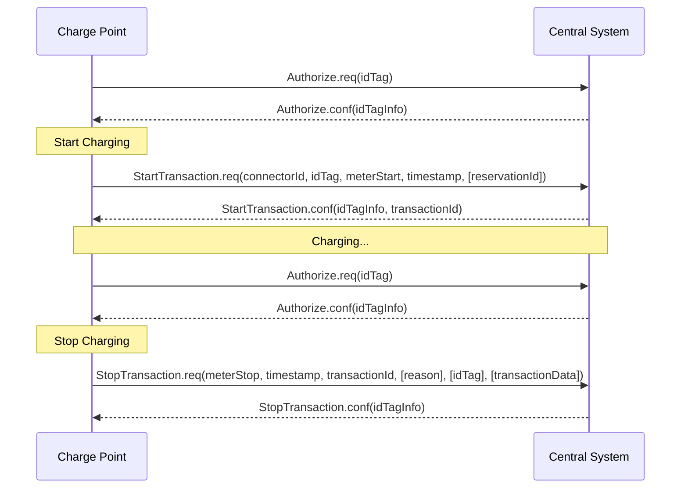
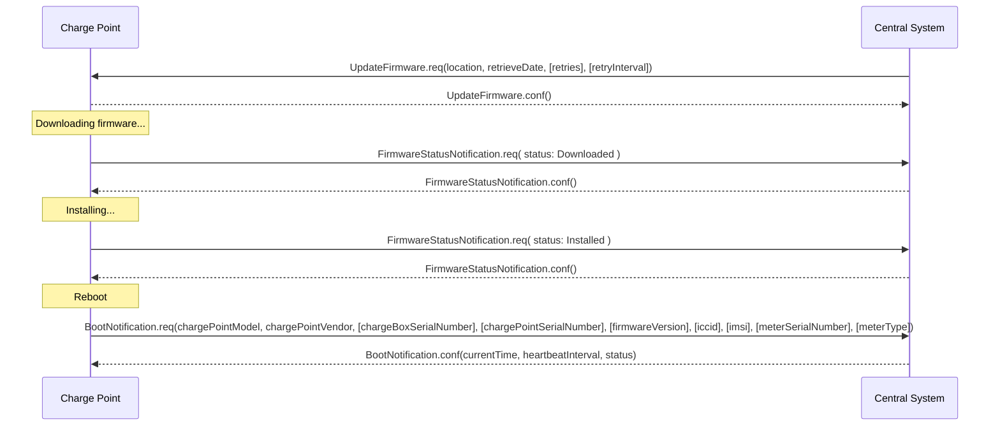
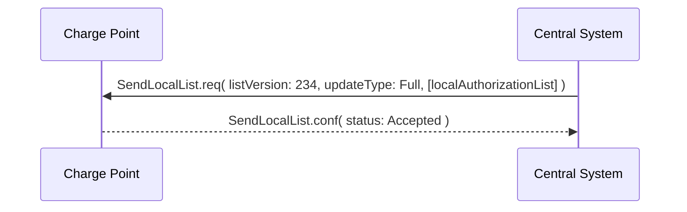
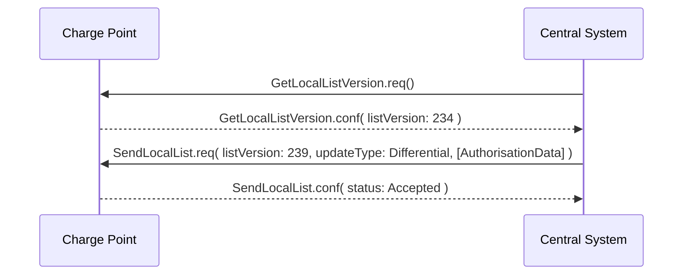
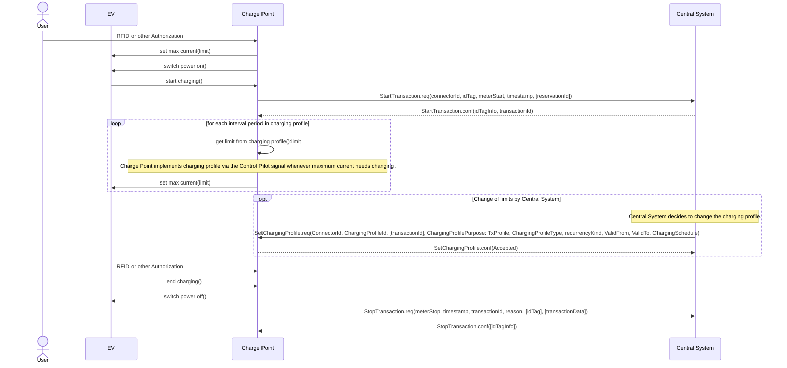
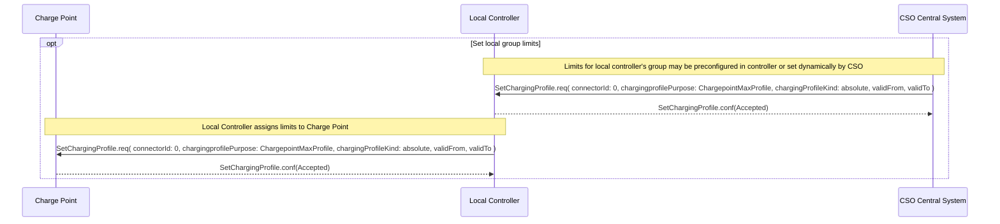
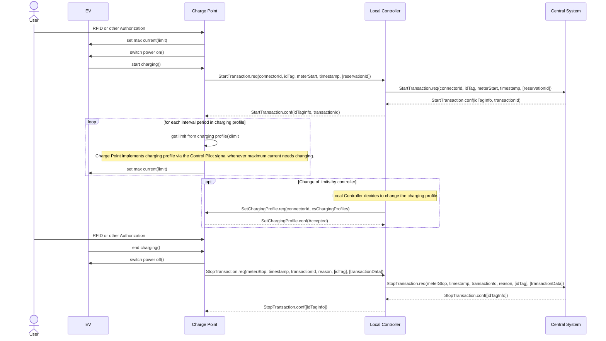

# 3. Introduction

This is the specification for OCPP version 1.6.

OCPP is a standard open protocol for communication between Charge Points and a Central System and is designed to accommodate any type of charging technique.

OCPP 1.6 introduces new features to accommodate the market: Smart Charging, OCPP using JSON over Websockets, better diagnostics possibilities (Reason), more Charge Point Statuses and TriggerMessage. OCPP 1.6 is based on OCPP 1.5, with some new features and a lot of textual improvements, clarifications and fixes for all known ambiguities. Due to improvements and new features, OCPP 1.6 is not backward compatible with OCPP 1.5.

For a full list of changes, see: [[New-in-OCPP-1.6|New in OCPP 1.6]].

Some basic concepts are explained in the sections below in this introductory chapter. The chapters: [[_Operations-MOC|Operations Initiated by Charge Point]] and [[_Operations-MOC|Operations Initiated by Central System]] describe the operations supported by the protocol. The exact messages and their parameters are detailed in the chapter: [[_Messages-MOC|Messages]] and data types are described in chapter: [[_Types-MOC|Types]]. Defined configuration keys are described in the chapter: [[_Configuration-MOC|Standard Configuration Key Names & Values]].

## 3.1. Edition 2

This document is OCPP 1.6 edition 2. This document still describes the same protocol: OCPP 1.6, only the documentation is improved. On message level there are no changes compared to the original release of OCPP 1.6 of October 2015. All known errata (previously published in a separate document) have been merged into this document, making it easier for the implementers to work with the specification. When there is doubt about the way OCPP 1.6 should be implemented, this document over rules the original document.

## 3.2. Document structure

With the introduction of OCPP 1.6, there are two different flavours of OCPP; next to the SOAP based implementations, there is the possibility to use the much more compact JSON alternative. To avoid confusion in communication on the type of implementation we recommend using the distinct suffixes -J and -S to indicate JSON or SOAP. In generic terms this would be OCPP-J for JSON and OCPP-S for SOAP.

To support the different flavours, the OCPP standard is divided in multiple documents. The base document (the one you are reading now) contains the technical protocol specification. The technical protocol specification must be used with one of the transport protocol specifications. the OCPP SOAP Specification contains the implementation specification needed to make a OCPP-S implementation. For OCPP-J, the OCPP JSON Specification must be used.

For improved interoperabillity between the Central Systems and Charge Points, it is adviced to meet the requirements stated in the OCPP 1.6 Compliance testing documentation.

## 3.3. Feature Profiles

This section is normative.

In OCPP 1.6 features and associated messages are grouped in profiles. Depending on the required functionality, implementers can choose to implement one or more of the following profiles.

| PROFILE NAME | DESCRIPTION |
|---|---|
| Core | Basic Charge Point functionality comparable with OCPP 1.5 [OCPP1.5] without support for firmware updates, local authorization list management and reservations. |
| Firmware Management | Support for firmware update management and diagnostic log file download. |
| Local Auth List Management | Features to manage the local authorization list in Charge Points. |
| Reservation | Support for reservation of a Charge Point. |
| Smart Charging | Support for basic Smart Charging, for instance using control pilot. |
| Remote Trigger | Support for remote triggering of Charge Point initiated messages |

These profiles can be used by a customer to determine if a OCPP 1.6 product has the required functionality for their business case. Compliance testing will test per profile if a product is compliant with the OCPP 1.6 specification.

Implementation of the Core profile is required. Other profiles are optional.

When the profiles Core, Firmware Management, Local Auth List Management and Reservation are implemented, all functions originating from OCPP 1.5 [OCPP1.5] are covered.

The grouping of all messages in their profiles can be found in the table below.

| MESSAGE | CORE | FIRMWARE MANAGEMENT | LOCAL AUTH LIST MANAGEMENT | REMOTE TRIGGER | RESERVATION | SMARTCHARGING |
|---|:---:|:---:|:---:|:---:|:---:|:---:|
| Authorize | X | | | | | |
| BootNotification | X | | | | | |
| ChangeAvailability | X | | | | | |
| ChangeConfiguration | X | | | | | |
| ClearCache | X | | | | | |
| DataTransfer | X | | | | | |
| GetConfiguration | X | | | | | |
| Heartbeat | X | | | | | |
| MeterValues | X | | | | | |
| RemoteStartTransaction | X | | | | | |
| RemoteStopTransaction | X | | | | | |
| Reset | X | | | | | |
| StartTransaction | X | | | | | |
| StatusNotification | X | | | | | |
| StopTransaction | X | | | | | |
| UnlockConnector | X | | | | | |
| GetDiagnostics | | X | | | | |
| DiagnosticsStatusNotification | | X | | | | |
| FirmwareStatusNotification | | X | | | | |
| UpdateFirmware | | X | | | | |
| GetLocalListVersion | | | X | | | |
| SendLocalList | | | X | | | |
| CancelReservation | | | | | X | |
| ReserveNow | | | | | X | |
| ClearChargingProfile | | | | | | X |
| GetCompositeSchedule | | | | | | X |
| SetChargingProfile | | | | | | X |
| TriggerMessage | | | | X | | |

The support for the specific feature profiles is reported by the `SupportedFeatureProfiles` configuration key.

## 3.4. General views of operation

This section is informative.

The following figures describe the general views of the operations between Charge Point and Central System for two cases:

1. a Charge Point requesting authentication of a card and sending charge transaction status,
2. Central System requesting a Charge Point to update its firmware.

The arrow labels in the following figures indicate the PDUs exchanged during the invocations of the operations. These PDUs are defined in detail in the [[_Messages-MOC|Messages]] section.

*Figure 1. Sequence Diagram: Example of starting and stopping a transaction*

When a Charge Point needs to charge an electric vehicle, it needs to authenticate the user first before the charging can be started. If the user is authorized the Charge Point informs the Central System that it has started with charging.

When a user wishes to unplug the electric vehicle from the Charge Point, the Charge Point needs to verify that the user is either the one that initiated the charging or that the user is in the same group and thus allowed to terminate the charging. Once authorized, the Charge Point informs the Central System that the charging has been stopped.

> A Charge Point MUST NOT send an Authorize.req before stopping a transaction if the presented idTag is the same as the idTag presented to start the transaction.

*Figure 2. Sequence Diagram: Example of a firmware update*

When a Charge Point needs to be updated with new firmware, the Central System informs the Charge Point of the time at which the Charge Point can start downloading the new firmware. The Charge Point SHALL notify the Central System after each step as it downloads and installs the new firmware.

## 3.5. Local Authorization & Offline Behavior

This section is normative.

In the event of unavailability of the communications or even of the Central System, the Charge Point is designed to operate stand-alone. In that situation, the Charge Point is said to be offline.

To improve the experience for users, a Charge Point MAY support local authorization of identifiers, using an Authorization Cache and/or a Local Authorization List.

This allows (a) authorization of a user when offline, and (b) faster (apparent) authorization response time when communication between Charge Point and Central System is slow.

The `LocalAuthorizeOffline` configuration key controls whether a Charge Point will authorize a user when offline using the Authorization Cache and/or the Local Authorization List.

The `LocalPreAuthorize` configuration key controls whether a Charge Point will use the Authorization Cache and/or the Local Authorization List to start a transaction without waiting for an authorization response from the Central System.

A Charge Point MAY support the (automatic) authorization of any presented identifier when offline, to avoid refusal of charging to bona-fide users that cannot be explicitly authorized by Local Authorization List/Authorization Cache entries. This functionality is explained in more detail in [[#3.5.4. Unknown Offline Authorization|Unknown Offline Authorization]].

### 3.5.1. Authorization Cache

A Charge Point MAY implement an Authorization Cache that autonomously maintains a record of previously presented identifiers that have been successfully authorized by the Central System. (Successfully meaning: a response received on a message containing an idTag)

If implemented, the Authorization Cache SHOULD conform to the following semantics:

- The Cache contains all the latest received identifiers (i.e. valid and NOT-valid).
- The Cache is updated using all received IdTagInfo (from Authorize.conf, StartTransaction.conf and StopTransaction.conf)
- When the validity of a Cache entry expires, it SHALL be changed to expired in the Cache.
- When an IdTagInfo is received for an identifier in the Cache, it SHALL be updated.
- If new identifier authorization data is received and the Authorization Cache is full, the Charge Point SHALL remove any NOT-valid entries, and then, if necessary, the oldest valid entries to make space for the new entry.
- Cache values SHOULD be stored in non-volatile memory, and SHOULD be persisted across reboots and power outages.
- When an identifier is presented that is stored in the cache as NOT-valid, and the Charge Point is online: an Authorize.req SHOULD be sent to the central System to check the current state of the identifier.

Operation of the Authorization Cache, when present, is reported (and controlled, where possible) by the `AuthorizationCacheEnabled` configuration key.

### 3.5.2. Local Authorization List

The Local Authorization List is a list of identifiers that can be synchronized with the Central System.

The list contains the authorization status of all (or a selection of) identifiers and the authorization status/expiration date.

Identifiers in the Local Authorization list can be marked as valid, expired, (temporarily) blocked, or blacklisted, corresponding to IdTagInfo status values Accepted/ConcurrentTx, Expired, Blocked, and Invalid, respectively.

These values may be used to provide more fine grained information to users (e.g. by display message) during local authorization.

The Local Authorization List SHOULD be maintained by the Charge Point in non-volatile memory, and SHOULD be persisted across reboots and power outages.

A Charge Point that supports Local Authorization List SHOULD implement the configuration key:

`LocalAuthListMaxLength` This gives the Central System a way to known the the maximum possible number of Local Authorization List elements in a Charge Point

The Charge Point indicates whether the Local Authorization List is supported by the presence or absence of the `LocalAuthListManagement` element in the value of the `SupportedFeatureProfiles` configuration key.

Whether the Local Authorization List is enabled is reported and controlled by the `LocalAuthListEnabled` configuration key.

The Central System can synchronize this list by either (1) sending a complete list of identifiers to replace the Local Authorization List or (2) by sending a list of changes (add, update, delete) to apply to the Local Authorization List. The operations to support this are [[Get-Local-List-Version|Get Local List Version]] and [[Send-Local-List|Send Local List]].

*Figure 3. Sequence Diagram: Example of a full local authorization list update*

*Figure 4. Sequence Diagram: Example of a differential local authorization list update*

The Charge Point SHALL NOT modify the contents of the Authorization List by any other means than upon a the receipt of a SendLocalList PDU from the Central System.

> Conflicts between the local authorization list and the validity reported in, for instance, a StartTransaction.conf message might occur. When this happens the Charge Point SHALL inform the Central System by sending a StatusNotification with ConnectorId set to 0, and ErrorCode set to 'LocalListConflict'.

### 3.5.3. Relation between Authorization Cache and Local Authorization List

The Authorization Cache and Local Authorization List are distinct logical data structures. Identifiers known in the Local Authorization List SHALL NOT be added to the Authorization Cache.

Where both Authorization Cache and Local Authorization List are supported, a Charge Point SHALL treat Local Authorization List entries as having priority over Authorization Cache entries for the same identifiers.

### 3.5.4. Unknown Offline Authorization

When offline, a Charge Point MAY allow automatic authorization of any "unknown" identifiers that cannot be explicitly authorized by Local Authorization List or Authorization Cache entries. Identifiers that are present in a Local Authorization List that have a status other than “Accepted” (Invalid, Blocked, Expired) MUST be rejected. Identifiers that were valid but are apparently expired due to passage of time MUST also be rejected.

Operation of the Unknown Offline Authorization capability, when supported, is reported (and controlled, where possible) by the `AllowOfflineTxForUnknownId` configuration key.

When connection to the Central Server is restored, the Charge Point SHALL send a Start Transaction request for any transaction that was authorized offline, as required by transaction-related message handling. When the authorization status in the StartTransaction.conf is not Accepted, and the transaction is still ongoing, the Charge Point SHOULD:

- when `StopTransactionOnInvalidId` is set to true: stop the transaction normally as stated in [[Stop-Transaction|Stop Transaction]]. The Reason field in the Stop Transaction request should be set to DeAuthorized. If the Charge Point has the possibility to lock the Charging Cable, it SHOULD keep the Charging Cable locked until the owner presents his identifier.
- when `StopTransactionOnInvalidId` is set to false: only stop energy delivery to the vehicle.

> In the case of an invalid identifier, an operator MAY choose to charge the EV with a minimum amount of energy so the EV is able to drive away. This amount is controlled by the optional configuration key: `MaxEnergyOnInvalidId`.

## 3.6. Transaction in relation to Energy Transfer Period

This section is informative.

The Energy Transfer Period is a period of time during wich energy is transferred between the EV and the EVSE.

There MAY be multiple Energy Transfer Periods during a Transaction.

Multiple Energy Transfer Periods can be separated by either:

- an EVSE-initiated supense of transfer during which de EVSE does not offer energy transfer
- an EV-initiated suspense of transfer during which the EV remains electrically connected to the EVSE
- an EV-initiated suspense of transfer during which the EV is not electrically connected to the EVSE.

A Central System MAY deduce the start and end of an Energy Transfer Period from: the MeterValues that are sent during the Transaction, the status notifications: Charging, SuspendedEV and/or SuspendedEVSE. etc.

Central System implementations need to take into account factors such as: Some EVs don’t go to state SuspendedEV: they might continue to trickle charge. Some Charge Point don’t even have a electrical meter.

The following describes the nesting of Session, Transaction, Energy Offer and Energy Flow (Figure 5):

- **Charging Session** — Charging Session is started when first interaction with user or EV occurs. This can be a card swipe, remote start of transaction, connection of cable and/or EV, parking bay occupancy detector, etc. Session ends at the point that the station is available again. No cable plugged, parking bay free.
- **Transaction** — Transaction starts at the point that all conditions for charging are met, for instance, EV is connected to Charge Point and user has been authorized. Transaction ends at the point where one of the preconditions for charging irrevocably becomes false, for instance when a user swipes to stop the transaction and the stop is authorized.
- **EnergyOfferPeriod** — Energy Offer Period starts when the EVSE is ready and willing to supply energy.
- **EnergyTransferPeriod** — Energy is transferred. During an EnergyOfferPeriod there may be periods the EV is not charging due to for instance, warm/full battery or EV internal smart charging.
- **EnergyOfferSuspendPeriod** — During a transaction, there may be periods the EnergyOffer to EV is suspended by the EVSE, for instance due to Smart Charging or local balancing.

*Figure 5. OCPP Charging Session and transaction definition*

## 3.7. Transaction-related messages

This section is normative.

The Charge Point SHOULD deliver transaction-related messages to the Central System in chronological order as soon as possible. Transaction-related messages are StartTransaction.req, StopTransaction.req and periodic or clock-aligned MeterValues.req messages.

When offline, the Charge Point MUST queue any transaction-related messages that it would have sent to the Central System if the Charge Point had been online.

In the event that a Charge Point has transaction-related messages queued to be sent to the Central System, new messages that are not transaction-related MAY be delivered immediately without waiting for the queue to be emptied. It is therefore allowed to send, for example, an Authorize request or a Notifications request before the transaction-related message queue has been emptied, so that customers are not kept waiting and urgent notifications are not delayed.

The delivery of new transaction-related messages SHALL wait until the queue has been emptied. This is to ensure that transaction-related messages are always delivered in chronological order.

When the Central System receives a transaction-related message that was queued on the Charge Point for some time, the Central System will not be aware that this is a historical message, other than by inference given that the various timestamps are significantly in the past. It SHOULD process such a message as any other.

### 3.7.1. Error responses to transaction-related messages

It is permissible for the Charge Point to skip a transaction-related message if and only if the Central System repeatedly reports a `failure to process the message'. Such a stipulation is necessary, because otherwise the requirement to deliver every transaction-related message in chronological order would entail that the Charge Point cannot deliver any transaction-related messages to the Central System after a software bug causes the Central System not to acknowledge one of the Charge Point’s transaction-related messages.

What kind of response, or failure to respond, constitutes a `failure to process the message' is defined in the documents OCPP JSON Specification and OCPP SOAP Specification.

The number of times and the interval with which the Charge Point should retry such failed transaction-related messages MAY be configured using the `TransactionMessageAttempts` and `TransactionMessageRetryInterval` configuration keys.

When the Charge Point encounters a first failure to deliver a certain transaction-related message, it SHOULD send this message again as long as it keeps resulting in a failure to process the message and it has not yet encountered as many failures to process the message for this message as specified in its `TransactionMessageAttempts` configuration key. Before every retransmission, it SHOULD wait as many seconds as specified in its `TransactionMessageRetryInterval` key, multiplied by the number of preceding transmissions of this same message.

As an example, consider a Charge Point that has the value "3" for the `TransactionMessageAttempts` configuration key and the value "60" for the `TransactionMessageRetryInterval` configuration key. It sends a StopTransaction message and detects a failure to process the message in the Central System. The Charge Point SHALL wait for 60 seconds, and resend the message. In the case when there is a second failure, the Charge Point SHALL wait for 120 seconds, before resending the message. If this final attempt fails, the Charge Point SHOULD discard the message and continue with the next transaction-related message, if there is any.

## 3.8. Connector numbering

This section is normative.

To enable Central System to be able to address all the connectors of a Charge Point, ConnectorIds MUST always be numbered in the same way.

Connectors numbering (ConnectorIds) MUST be as follows:

- ID of the first connector MUST be 1
- Additional connectors MUST be sequentially numbered (no numbers may be skipped)
- ConnectorIds MUST never be higher than the total number of connectors of a Charge Point
- For operations intiated by the Central System, ConnectorId 0 is reserved for addressing the entire Charge Point.
- For operations initiated by the Charge Point (when reporting), ConnectorId 0 is reserved for the Charge Point main controller.

Example: A Charge Point with 3 connectors: All connectors MUST be numbered with the IDs: 1, 2 and 3. It is advisable to number the connectors of a Charge Point in a logical way: from left to right, top to bottom incrementing.

## 3.9. ID Tokens

This section is normative.

In most cases, IdToken data acquired via local token reader hardware is usually a (4 or 7 byte) UID value of a physical RFID card, typically represented as 8/14 hexadecimal digit characters.

However, IdTokens sent to Charge Points by Central Systems for remotely initiated charging sessions may commonly be (single use) virtual transaction authorization codes, or virtual RFID tokens that deliberately use a non-standard UID format to avoid possible conflict with real UID values.

Also, IdToken data used as ParentIds may often use a shared central account identifier for the ParentId, instead of a UID of the first/master RFID card of an account.

Therefore, message data elements of the IdToken class (including ParentId) MAY contain any data, subject to the constraints of the data-type (CiString20Type), that is meaningful to a Central System (e.g. for the purpose of identifying the initiator of charging activity), and Charge Points MUST NOT make any presumptions as to the format or content of such data (e.g. by assuming that it is a UID-like value that must be hex characters only and/or an even number of digits).

> To promote interoperability, based on common practice to date in the case of IdToken data representing physical ISO 14443 compatible RFID card UIDs, it is RECOMMENDED that such UIDs be represented as hex representations of the UID bytes. According to ISO14443-3, byte 0 should come first in the hex string.

## 3.10. Parent idTag

This section is normative.

A Central System has the ability to treat a set of identity tokens as a “group”, thereby allowing any one token in the group to start a transaction and for the same token, or another token in the same group, to stop the transaction. This supports the common use-cases of families or businesses with multiple drivers using one or more shared electric vehicles on a single recharging contract account.

Tokens (idTags) are grouped for authorization purposes by specifying a common group identifier in the optional ParentId element in IdTagInfo: two idTags are considered to be in the same group if their ParentId Tags match.

> Even though the ParentId has the same nominal data type (IdToken) as an idTag, the value of this element may not be in the common format of IdTokens and/or may not represent an actual valid IdToken (e.g. it may be a common shared "account number"): therefore, the ParentId value SHOULD NOT be used for comparison against a presented Token value (unless it also occurs as an idTag value).

## 3.11. Reservations

This section is informative.

Reservation of a Charge Point is possible using the [[Reserve-Now|Reserve Now]] operation. This operation reserves the Charge Point until a certain expiry time for a specific idTag. A parent idTag may be included in the reservation to support ‘group’ reservations. It is possible to reserve a specific connector on a Charge Point or to reserve any connector on a Charge Point. A reservation is released when the reserved idTag is used on the reserved connector (when specified) or on any connector (when unspecified) or when the expiry time is reached or when the reservation is explicitly canceled.

## 3.12. Vendor-specific data transfer

This section is informative.

The mechanism of vendor-specific data transfer allows for the exchange of data or messages not standardized in OCPP . As such, it offers a framework within OCPP for experimental functionality that may find its way into future OCPP versions. Experimenting can be done without creating new (possibly incompatible) OCPP dialects.

Secondly, it offers a possibility to implement additional functionality agreed upon between specific Central System and Charge Point vendors.

The operation Vendor Specific Data MAY be initiated either by the Central System or by the Charge Point.

> Please use with extreme caution and only for optional functionality, since it will impact your compatibility with other systems that do not make use of this option. We recommend mentioning the usage explicitly in your documentation and/or communication. Please consider consulting the Open Charge Alliance before turning to this option to add functionality.

## 3.13. Smart Charging

This section is normative.

With Smart Charging a Central System gains the ability to influence the charging power or current of a specific EV, or the total allowed energy consumption on an entire Charge Point / a group of Charge Points, for instance, based on a grid connection, energy availability on the gird or the wiring of a building. Influencing the charge power or current is based on energy transfer limits at specific points in time. Those limits are combined in a Charging Profile.

### 3.13.1. Charging profile purposes

A charging profile consists of a charging schedule, which is basically a list of time intervals with their maximum charge power or current, and some values to specify the time period and recurrence of the schedule.

There are three different types of charging profiles, depending on their purpose:

- **ChargePointMaxProfile**

  In load balancing scenarios, the Charge Point has one or more local charging profiles that limit the power or current to be shared by all connectors of the Charge Point. The Central System SHALL configure such a profile with ChargingProfilePurpose set to “ChargePointMaxProfile”. ChargePointMaxProfile can only be set at Charge Point ConnectorId 0.

- **TxDefaultProfile**

  Default schedules for new transactions MAY be used to impose charging policies. An example could be a policy that prevents charging during the day. For schedules of this purpose, ChargingProfilePurpose SHALL be set to TxDefaultProfile.

  If TxDefaultProfile is set to ConnectorId 0, the TxDefaultProfile is applicable to all Connectors.
  If ConnectorId is set >0, it only applies to that specific connector.
  In the event a TxDefaultProfile for connector 0 is installed, and the Central System sends a new profile with ConnectorId >0, the TxDefaultProfile SHALL be replaced only for that specific connector.

- **TxProfile**

  If a transaction-specific profile with purpose TxProfile is present, it SHALL overrule the default charging profile with purpose TxDefaultProfile for the duration of the current transaction only. After the transaction is stopped, the profile SHOULD be deleted. If there is no transaction active on the connector specified in a charging profile of type TxProfile, then the Charge Point SHALL discard it and return an error status in SetChargingProfile.conf.

The final schedule constraints that apply to a transaction are determined by merging the profiles with purposes ChargePointMaxProfile with the profile TxProfile or the TxDefaultProfile in case no profile of purpose TxProfile is provided. TxProfile SHALL only be set at Charge Point ConnectorId >0.

### 3.13.2. Stacking charging profiles

It is allowed to stack charging profiles of the same charging profile purpose in order to describe complex calendars. For example, one can define a charging profile of purpose TxDefaultProfile with a duration and recurrence of one week that allows full power or current charging on weekdays from 23:00h to 06:00h and from 00:00h to 24:00h in weekends and reduced power or current charging at other times. On top of that, one can define other TxDefaultProfiles that define exception to this rule, for example for holidays.

Precedence of charging profiles is determined by the value of their StackLevel parameter. At any point in time the prevailing charging profile SHALL be the charging profile with the highest stackLevel among the profiles that are valid at that point in time, as determined by their validFrom and validTo parameters.

To avoid conflicts, the existence of multiple Charging Profiles with the same stackLevel and Purposes in a Charge Point is not allowed. Whenever a Charge Point receives a Charging Profile with a stackLevel and Purpose that already exists in the Charge Point, the Charge Point SHALL replace the existing profile.

> In the case an updated charging profile (with the same stackLevel and purpose) is sent with a validFrom dateTime in the future, the Charge Point SHALL replace the installed profile and SHALL revert to default behavior until validFrom is reached. It is RECOMMENDED to provide a start time in the past to prevent gaps.

> If you use Stacking without a duration, on the highest stack level, the Charge Point will never fall back to a lower stack level profile.

### 3.13.3. Combining charging profile purposes

The Composite Schedule that will guide the charging level is a combination of the prevailing Charging Profiles of the different chargingProfilePurposes.

This Composite Schedule is calculated by taking the minimum value for each time interval. Note that time intervals do not have to be of fixed length, nor do they have to be the same for every charging profile purpose. This means that a resulting Composite Schedule MAY contain intervals of different lengths.

At any point in time, the available power or current in the Composite Schedule, which is the result of merging the schedules of charging profiles ChargePointMaxProfile and TxDefaultProfile (or TxProfile), SHALL be less than or equal to lowest value of available power or current in any of the merged schedules.

In the case the Charge Point is equipped with more than one Connector, the limit value of ChargePointMaxProfile is the limit for all connectors combined. The combined energy flow of all connectors SHALL NOT be greater then the limit set by ChargePointMaxProfile.

### 3.13.4. Smart Charging Use Cases

This section is informative.

There may be many different uses for smart charging. The following three typical kinds of smart charging will be used to illustrate the possible behavior of smart charging:

- Load balancing
- Central smart charging
- Local smart charging

There are more complex use cases possible in which two or more of the above use cases are combined into one more complex system.

#### Load Balancing

This section is informative.

The Load Balancing use case is about internal load balancing within the Charge Point, the Charge Point controls the charging schedule per connector. The Charge Point is configured with a fixed limit, for example the maximum current of the connection to the grid.

The optional charging schedule field minChargingRate may be used by the Charge Point to optimize the power distribution between the connectors. The parameter informs the Charge Point that charging below minChargingRate is inefficient, giving the possibility to select another balancing strategy.

*Figure 6. Load balancing Smart Charging topology*

#### Central Smart Charging

This section is informative.

With Central smart charging the constraints on the charging schedule, per transaction, are determined by the Central System. The Central System uses these schedules to stay within limits imposed by any external system.

The Central System directly controls the limits on the connectors of the Charge Points.

*Figure 7. Central Smart Charging topology*

Central smart charging assumes that charge limits are controlled by the Central System. The Central System receives a capacity forecast from the grid operator (DSO) or another source in one form or another and calculates charging schedules for some or all charging transactions, details of which are out of scope of this specification.

The Central System imposes charging limits on connectors. In response to a StartTransaction.req PDU The Central System may choose to set charging limits to the transaction using the TxProfile

Central Smart Charging can be done with a Control Pilot signal, albeit with some limitations, because an EV cannot communicate its charging via the Control Pilot signal. In analogy to the Local Smart Charging use case, a connector can execute a charging schedule by the Control Pilot signal. This is illustrated in the Figure below:

*Figure 8. Sequence Diagram: Central Smart Charging*

Explanation for the above figure:

- After authorization the connector will set a maximum current to use via the Control Pilot signal. This limit is based on a (default) charging profile that the connector had previously received from the Central System. The EV starts charging and a StartTransaction.req is sent to the Central System.
- While charging is in progress the connector will continuously adapt the maximum current or power according to the charging profile. Optionally, at any point in time the Central System may send a new charging profile for the connector that shall be used as a limit schedule for the EV.

#### Local Smart Charging

The Local Smart Charging use case describes a use case in which smart charging enabled Charge Points have charging limits controlled locally by a Local Controller, not the Central System. The use case for local smart charging is about limiting the amount of power that can be used by a group of Charge Points, to a certain maximum. A typical use would be a number of Charge Points in a parking garage where the rating of the connection to the grid is less than the sum the ratings of the Charge Points. Another application might be that the Local Controller receives information about the availability of power from a DSO or a local smart grid node.

*Figure 9. Local Smart Charging topology*

Local smart charging assumes the existence of a Local Controller to control a group of Charge Points. The Local Controller is a logical component. It may be implemented either as a separate physical component or as part of a ‘master’ Charge Point controlling a number of other Charge Points. The Local Control implements the OCPP protocol and is a proxy for the group members' OCPP messages, and may or may not have any connectors of its own.

In the case of local smart charging the Local Controller imposes charging limits on a Charge Point. These limits may be changed dynamically during the charging process in order to keep the power consumption of the group of Charge Points within the group limits. The group limits may be pre-configured in the Local Controller or may have been configured by the Central System.

The optional charging schedule field minChargingRate may be used by the Local Controller to optimize the power distribution between the connectors. The parameter informs the Local Controller that charging below minChargingRate is inefficient, giving the possibility to select another balancing strategy.

The following diagram illustrates the sequence of messages to set charging limits on Charge Points in a Local Smart Charging group. These limits can either be pre-configured in the Local Controller in one way or another, or they can be set by the Central System. The Local Controller contains the logic to distribute this capacity among the connected connectors by adjusting their limits as needed.

*Figure 10. Presetting Local Group Limits*

The next diagram describe the sequence of messages for a typical case of Local Smart Charging. For simplicity’s sake, this case only involves one connector.

*Figure 11. Sequence Diagram: Local Smart Charging*

Explanation for the above figure:

- After authorization the connector will set a maximum current to use, via the Control Pilot signal. This limit is based on a (default) charging profile that the connector had previously received from the Local Controller. The EV starts charging and sends a StartTransaction.req.
- The StartTransaction.req is sent to the Central System via the Local Controller, so that also the Local Controller knows a transaction has started. The Local Controller just passes on the messages between Charge Point and Central System, so that the Central System can address all the Local Smart Charging group members individually.
- While charging is in progress the connector will continuously adapt the maximum current according to the charging profile.

Optionally, at any point in time the Local Controller may send a new charging profile to the connector that shall be used as a limit schedule for the EV.

### 3.13.5. Discovery of Charge Point Capabilities

This section is normative.

The smart charging options defined can be used in extensive ways. Because of the possible limitations and differences in capabilities between Charge Points, the Central System needs to be able to discover the Charge Point specific capabilities. This is ensured by the standardized configuration keys as defined in this chapter. A Smart Charging enabled Charge Point SHALL implement, and support reporting of, the following configuration keys through the GetConfiguration.req PDU

| SMART CHARGING CONFIGURATION KEYS |
|---|
| ChargeProfileMaxStackLevel |
| ChargingScheduleAllowedChargingRateUnit |
| ChargingScheduleMaxPeriods |
| MaxChargingProfilesInstalled |

A full list of all standardized configuration keys can be found in chapter [[_Configuration-MOC|Standard Configuration Key Names & Values]].

### 3.13.6. Offline behavior of smart charging

This section is normative.

If a Charge Point goes offline after having received a transaction-specific charging profile with purpose TxProfile, then it SHALL continue to use this profile for the duration of the transaction.

If a Charge Point goes offline before a transaction is started or before a transaction-specific charging profile with purpose TxProfile was received, then it SHALL use the charging profiles that are available. Zero or more of the following charging profile purposes MAY have been previously received from the Central System:

- ChargePointMaxProfile
- TxDefaultProfile

See section [[#3.13.3. Combining charging profile purposes|Combining Charging Profile Purposes]] for a description on how to combine charging profiles with different purposes.

If a Charge Point goes offline, without having any charging profiles, then it SHALL execute a transaction as if no constraints apply.

### 3.13.7. Example data structure for smart charging

This section is informative

The following data structure describes a daily default profile that limits the power to 6 kW between 08:00h and 20:00h.

| CHARGINGPROFILE | |
|---|---|
| chargingProfileId | 100 |
| stackLevel | 0 |
| chargingProfilePurpose | TxDefaultProfile |
| chargingProfileKind | Recurring |
| recurrencyKind | Daily |
| chargingSchedule | (List of 1 ChargingSchedule elements) |

| ChargingSchedule | |
|---|---|
| duration | 86400 (= 24 hours) |
| startSchedule | 2013-01-01T00:00Z |
| chargingRateUnit | W |
| chargingSchedulePeriod | (List of 3 ChargingSchedulePeriod elements) |

| ChargingSchedulePeriod | startPeriod | limit | numberPhases |
|---|---|---|---|
| | 0 (=00:00) | 11000 | 3 |
| | 28800 (=08:00) | 6000 | 3 |
| | 72000 (=20:00) | 11000 | 3 |

> The amount of phases used during charging is limited by the capabilities of: The Charge Point, EV and Cable between CP and EV. If any of these 3 is not capable of 3 phase charging, the EV will be charged using 1 phase only.

> Switching the number of used phases during a schedule or charging session should be done with care. Some EVs may not support this and changing the amount of phases may result in physical damage. With the configuration key: `ConnectorSwitch3to1PhaseSupported` The Charge Point can tell if it supports switching the amount of phases during a transaction.

> On days on which DST goes into or out of effect, a special profile might be needed (e.g. for relative profiles).

## 3.14. Time zones

This section is informative.

OCPP does not prescribe the use of a specific time zone for time values. However, it is strongly recommended to use UTC for all time values to improve interoperability between Central Systems and Charge Points.

## 3.15. Time notations

This section is normative.

Implementations MUST use ISO 8601 date time notation. Message receivers must be able to handle fractional seconds and time zone offsets (another implementation might use them). Message senders MAY save data usage by omitting insignificant fractions of seconds.

## 3.16. Metering Data

This section is normative.

Extensive metering data relating to charging sessions can be recorded and transmitted in different ways depending on its intended purpose. There are two obvious use cases (but the use of meter values is not limited to these two):

- Charging Session Meter Values
- Clock-Aligned Meter Values

Both types of meter readings MAY be reported in standalone MeterValues.req messages (during a transaction) and/or as part of the transactionData element of the StopTransaction.req PDU.

### 3.16.1. Charging Session Meter Values

Frequent (e.g. 1-5 minute interval) meter readings taken and transmitted (usually in "real time") to the Central System, to allow it to provide information updates to the EV user (who is usually not at the charge point), via web, app, SMS, etc., as to the progress of the charging session. In OCPP, this is called "sampled meter data", as the exact frequency and time of readings is not very significant, as long as it is "frequent enough". "Sampled meter data" can be configured with the following configuration keys:

- MeterValuesSampledData
- MeterValuesSampledDataMaxLength
- MeterValueSampleInterval
- StopTxnSampledData
- StopTxnSampledDataMaxLength

`MeterValueSampleInterval` is the time (in seconds) between sampling of metering (or other) data, intended to be transmitted by "MeterValues" PDUs. Samples are acquired and transmitted periodically at this interval from the start of the charging transaction.

A value of "0" (numeric zero), by convention, is to be interpreted to mean that no sampled data should be transmitted.

`MeterValuesSampledData` is a comma separated list that prescribes the set of measurands to be included in a MeterValues.req PDU, every MeterValueSampleInterval seconds. The maximum amount of elements in the MeterValuesSampledData list can be reported by the Charge Point via: `MeterValuesSampledDataMaxLength`

`StopTxnSampledData` is a comma separated list that prescribes the sampled measurands to be included in the TransactionData element of StopTransaction.req PDU, every MeterValueSampleInterval seconds from the start of the Transaction. The maximum amount of elements in the StopTxnSampledData list can be reported by the Charge Point via: `StopTxnSampledDataMaxLength`

### 3.16.2. Clock-Aligned Meter Values

Grid Operator might require meter readings to be taken from fiscally certified energy meters, at specific Clock aligned times (usually every quarter hour, or half hour).

"Clock-Aligned Billing Data" can be configured with the following configuration keys:

- ClockAlignedDataInterval
- MeterValuesAlignedData
- MeterValuesAlignedDataMaxLength
- StopTxnAlignedData
- StopTxnAlignedDataMaxLength

`ClockAlignedDataInterval` is the size of the clock-aligned data interval (in seconds). This defines the set of evenly spaced meter data aggregation intervals per day, starting at 00:00:00 (midnight).

For example, a value of 900 (15 minutes) indicates that every day should be broken into 96 15-minute intervals.

A value of "0" (numeric zero), by convention, is to be interpreted to mean that no clock-aligned data should be transmitted.

`MeterValuesAlignedData` is a comma separated list that prescribes the set of measurands to be included in a MeterValues.req PDU, every ClockAlignedDataInterval seconds. The maximum amount of elements in the MeterValuesAlignedData list can be reported by the Charge Point via: `MeterValuesAlignedDataMaxLength`

`StopTxnAlignedData` is a comma separated list that prescribes the set of clock-aligned periodic measurands to be included in the TransactionData element of StopTransaction.req PDU for every ClockAlignedDataInterval of the Transaction. The maximum amount of elements in the StopTxnAlignedData list can be reported by the Charge Point via: `StopTxnAlignedDataMaxLength`

### 3.16.3. Multiple Locations/Phases

When a Charge Point can measure the same measurand on multiple locations or phases, all possible locations and/or phases SHALL be reported when configured in one of the relevant configuration keys.

For example: A Charge Point capable of measuring Current.Import on Inlet (all 3 phases) (grid connection) and Outlet (3 phases per connector on both its connectors). Current.Import is set in MeterValuesSampledData. MeterValueSampleInterval is set to 300 (seconds). Then the Charge Point should send:

- a MeterValues.req with: connectorId = 0; with 3 SampledValue elements, one per phase with location = Inlet.
- a MeterValues.req with: connectorId = 1; with 3 SampledValue elements, one per phase with location = Outlet.
- a MeterValues.req with: connectorId = 2; with 3 SampledValue elements, one per phase with location = Outlet.

### 3.16.4. Unsupported measurands

When a Central System sends a ChangeConfiguration.req to a Charge Point with one of the following configuration keys:

- MeterValuesAlignedData
- MeterValuesSampledData
- StopTxnAlignedData
- StopTxnSampledData

If the comma separated list contains one or more measurands that are not supported by this Charge Point, the Charge Point SHALL respond with: ChangeConfiguration.conf with: status = Rejected. No changes SHALL be made to the currently configuration.

### 3.16.5. No metering data in a Stop Transaction

When the configuration keys: StopTxnAlignedData and StopTxnSampledData are set to an empty string, the Charge Point SHALL not put meter values in a StopTransaction.req PDU.
