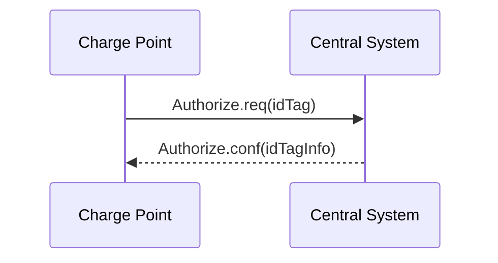
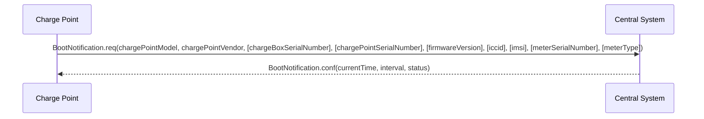
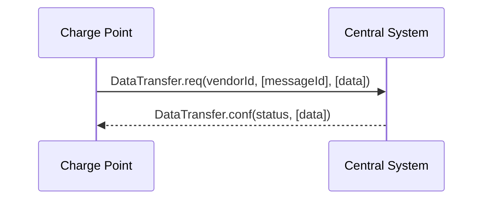
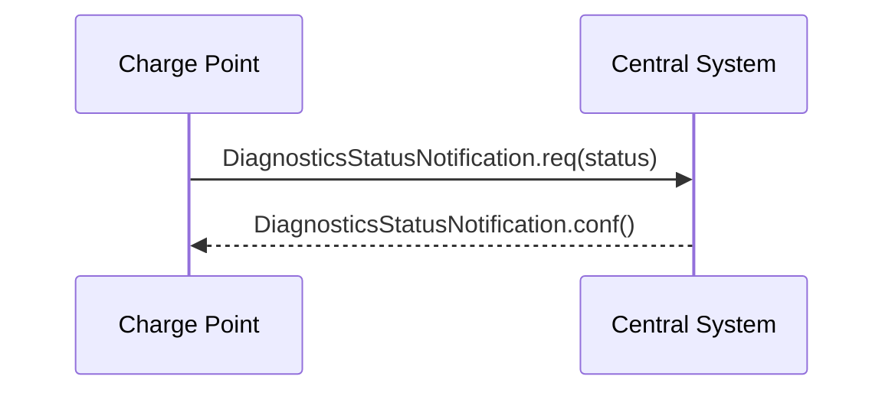
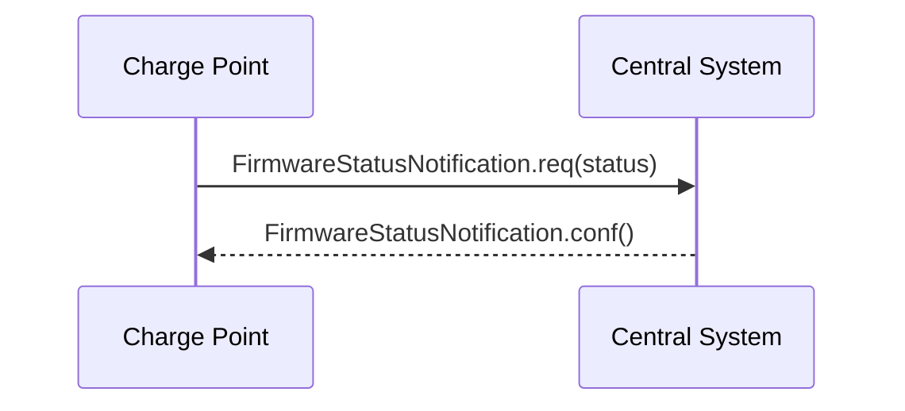
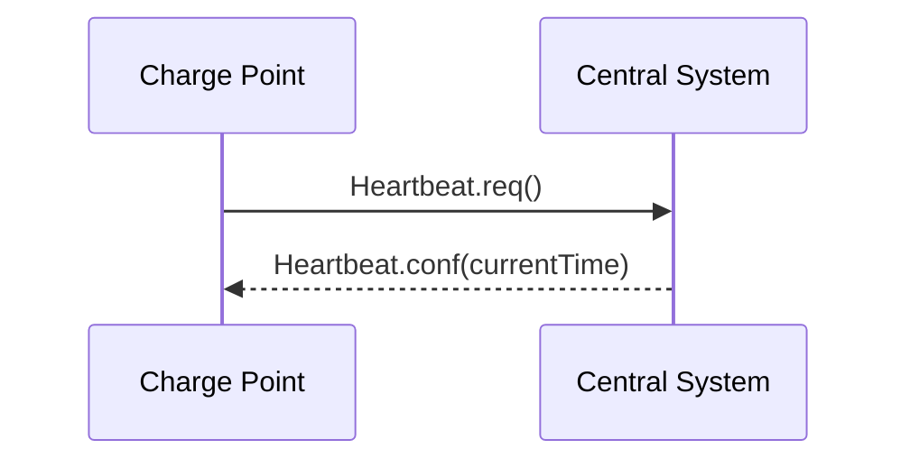
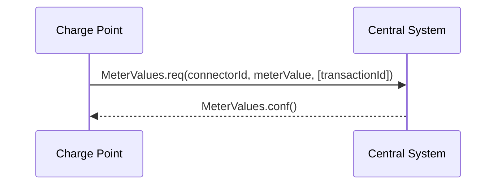
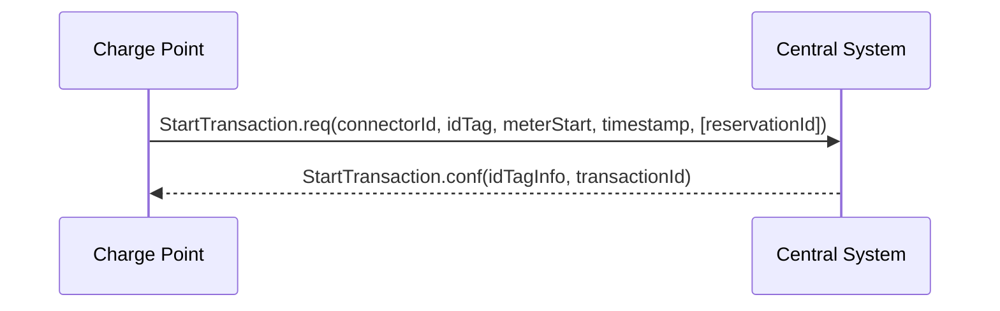
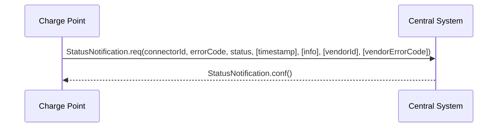
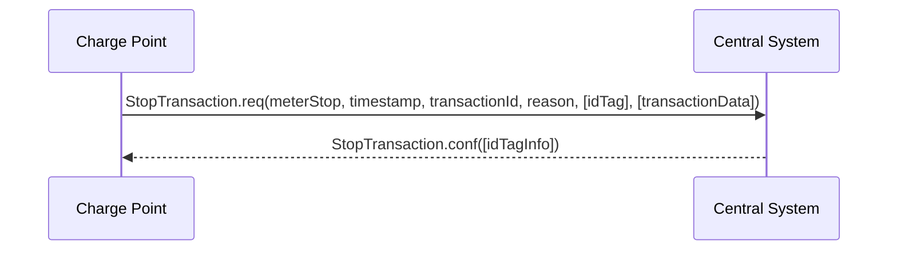

# 4. Operations Initiated by Charge Point

## 4.1. Authorize

*Figure 12. Sequence Diagram: Authorize*

Before the owner of an electric vehicle can start or stop charging, the Charge Point has to authorize the operation. The Charge Point SHALL only supply energy after authorization. When stopping a Transaction, the Charge Point SHALL only send an Authorize.req when the identifier used for stopping the transaction is different from the identifier that started the transaction.

Authorize.req SHOULD only be used for the authorization of an identifier for charging.

A Charge Point MAY authorize identifier locally without involving the Central System, as described in [[03-Introduction#3.5.2. Local Authorization List|Local Authorization List]]. If an idTag presented by the user is not present in the Local Authorization List or Authorization Cache, then the Charge Point SHALL send an Authorize.req PDU to the Central System to request authorization. If the idTag is present in the Local Authorization List or Authorization Cache, then the Charge Point MAY send an Authorize.req PDU to the Central System.

Upon receipt of an Authorize.req PDU, the Central System SHALL respond with an Authorize.conf PDU. This response PDU SHALL indicate whether or not the idTag is accepted by the Central System. If the Central System accepts the idTag then the response PDU MAY include a parentIdTag and MUST include an authorization status value indicating acceptance or a reason for rejection.

If Charge Point has implemented an Authorization Cache, then upon receipt of an Authorize.conf PDU the Charge Point SHALL update the cache entry, if the idTag is not in the Local Authorization List, with the IdTagInfo value from the response as described under [[03-Introduction#3.5.1. Authorization Cache|Authorization Cache]].

## 4.2. Boot Notification

*Figure 13. Sequence Diagram: Boot Notification*

After start-up, a Charge Point SHALL send a request to the Central System with information about its configuration (e.g. version, vendor, etc.). The Central System SHALL respond to indicate whether it will accept the Charge Point.

The Charge Point SHALL send a BootNotification.req PDU each time it boots or reboots. Between the physical power-on/reboot and the successful completion of a BootNotification, where Central System returns Accepted or Pending, the Charge Point SHALL NOT send any other request to the Central System. This includes cached messages that are still present in the Charge Point from before.

When the Central System responds with a BootNotification.conf with a status Accepted, the Charge Point will adjust the heartbeat interval in accordance with the interval from the response PDU and it is RECOMMENDED to synchronize its internal clock with the supplied Central System’s current time. If the Central System returns something other than Accepted, the value of the interval field indicates the minimum wait time before sending a next BootNotification request. If that interval value is zero, the Charge Point chooses a waiting interval on its own, in a way that avoids flooding the Central System with requests. A Charge Point SHOULD NOT send a BootNotification.req earlier, unless requested to do so with a TriggerMessage.req.

If the Central System returns the status Rejected, the Charge Point SHALL NOT send any OCPP message to the Central System until the aforementioned retry interval has expired. During this interval the Charge Point may no longer be reachable from the Central System. It MAY for instance close its communication channel or shut down its communication hardware. Also the Central System MAY close the communication channel, for instance to free up system resources. While Rejected, the Charge Point SHALL NOT respond to any Central System initiated message. the Central System SHOULD NOT initiate any.

The Central System MAY also return a Pending registration status to indicate that it wants to retrieve or set certain information on the Charge Point before the Central System will accept the Charge Point. If the Central System returns the Pending status, the communication channel SHOULD NOT be closed by either the Charge Point or the Central System. The Central System MAY send request messages to retrieve information from the Charge Point or change its configuration. The Charge Point SHOULD respond to these messages. The Charge Point SHALL NOT send request messages to the Central System unless it has been instructed by the Central System to do so with a TriggerMessage.req request.

While in pending state, the following Central System initiated messages are not allowed: RemoteStartTransaction.req and RemoteStopTransaction.req

### 4.2.1. Transactions before being accepted by a Central System

A Charge Point Operator MAY choose to configure a Charge Point to accept transactions before the Charge Point is accepted by a Central System. Parties who want to implement this such behavior should realize that it is uncertain if those transactions can ever be delivered to the Central System.

After a restart (for instance due to a remote reset command, power outage, firmware update, software error etc.) the Charge Point MUST again contact the Central System and SHALL send a BootNotification request. If the Charge Point fails to receive a BootNotification.conf from the Central System, and has no in-built non-volatile real-time clock hardware that has been correctly preset, the Charge Point may not have a valid date / time setting, making it impossible to later determine the date / time of transactions.

It might also be the case (e.g. due to configuration error) that the Central System indicates a status other than Accepted for an extended period of time, or indefinitely.

It is usually advisable to deny all charging services at a Charge Point if the Charge Point has never before been Accepted by the Central System (using the current connection settings, URL, etc.) since users cannot be authenticated and running transactions could conflict with provisioning processes.

## 4.3. Data Transfer

*Figure 14. Sequence Diagram: Data Transfer*

If a Charge Point needs to send information to the Central System for a function not supported by OCPP, it SHALL use the DataTransfer.req PDU.

The vendorId in the request SHOULD be known to the Central System and uniquely identify the vendor-specific implementation. The VendorId SHOULD be a value from the reversed DNS namespace, where the top tiers of the name, when reversed, should correspond to the publicly registered primary DNS name of the Vendor organisation.

Optionally, the messageId in the request PDU MAY be used to indicate a specific message or implementation.

The length of data in both the request and response PDU is undefined and should be agreed upon by all parties involved.

If the recipient of the request has no implementation for the specific vendorId it SHALL return a status ‘UnknownVendor’ and the data element SHALL not be present. In case of a messageId mismatch (if used) the recipient SHALL return status ‘UnknownMessageId’. In all other cases the usage of status ‘Accepted’ or ‘Rejected’ and the data element is part of the vendor-specific agreement between the parties involved.

## 4.4. Diagnostics Status Notification

*Figure 15. Sequence Diagram: Diagnostics Status Notification*

Charge Point sends a notification to inform the Central System about the status of a diagnostics upload. The Charge Point SHALL send a DiagnosticsStatusNotification.req PDU to inform the Central System that the upload of diagnostics is busy or has finished successfully or failed. The Charge Point SHALL only send the status Idle after receipt of a TriggerMessage for a Diagnostics Status Notification, when it is not busy uploading diagnostics.

Upon receipt of a DiagnosticsStatusNotification.req PDU, the Central System SHALL respond with a DiagnosticsStatusNotification.conf.

## 4.5. Firmware Status Notification

*Figure 16. Sequence Diagram: Firmware Status Notification*

A Charge Point sends notifications to inform the Central System about the progress of the firmware update. The Charge Point SHALL send a FirmwareStatusNotification.req PDU for informing the Central System about the progress of the downloading and installation of a firmware update. The Charge Point SHALL only send the status Idle after receipt of a TriggerMessage for a Firmware Status Notification, when it is not busy downloading/installing firmware.

Upon receipt of a FirmwareStatusNotification.req PDU, the Central System SHALL respond with a FirmwareStatusNotification.conf.

The FirmwareStatusNotification.req PDUs SHALL be sent to keep the Central System updated with the status of the update process, started by the Central System with a FirmwareUpdate.req PDU.

## 4.6. Heartbeat

*Figure 17. Sequence Diagram: Heartbeat*

To let the Central System know that a Charge Point is still connected, a Charge Point sends a heartbeat after a configurable time interval.

The Charge Point SHALL send a Heartbeat.req PDU for ensuring that the Central System knows that a Charge Point is still alive.

Upon receipt of a Heartbeat.req PDU, the Central System SHALL respond with a Heartbeat.conf. The response PDU SHALL contain the current time of the Central System, which is RECOMMENDED to be used by the Charge Point to synchronize its internal clock.

The Charge Point MAY skip sending a Heartbeat.req PDU when another PDU has been sent to the Central System within the configured heartbeat interval. This implies that a Central System SHOULD assume availability of a Charge Point whenever a PDU has been received, the same way as it would have, when it received a Heartbeat.req PDU.

> With JSON over WebSocket, sending heartbeats is not mandatory. However, for time synchronization it is advised to at least send one heartbeat per 24 hour.

## 4.7. Meter Values

*Figure 18. Sequence Diagram: Meter Values*

A Charge Point MAY sample the electrical meter or other sensor/transducer hardware to provide extra information about its meter values. It is up to the Charge Point to decide when it will send meter values. This can be configured using the ChangeConfiguration.req message to data acquisition intervals and specify data to be acquired & reported.

The Charge Point SHALL send a MeterValues.req PDU for offloading meter values. The request PDU SHALL contain for each sample:

1. The id of the Connector from which samples were taken. If the connectorId is 0, it is associated with the entire Charge Point. If the connectorId is 0 and the Measurand is energy related, the sample SHOULD be taken from the main energy meter.
2. The transactionId of the transaction to which these values are related, if applicable. If there is no transaction in progress or if the values are taken from the main meter, then transaction id may be omitted.
3. One or more meterValue elements, of type MeterValue, each representing a set of one or more data values taken at a particular point in time.

Each MeterValue element contains a timestamp and a set of one or more individual sampledvalue elements, all captured at the same point in time. Each sampledValue element contains a single value datum. The nature of each sampledValue is determined by the optional measurand, context, location, unit, phase, and format fields.

The optional measurand field specifies the type of value being measured/reported.

The optional context field specifies the reason/event triggering the reading.

The optional location field specifies where the measurement is taken (e.g. Inlet, Outlet).

The optional phase field specifies to which phase or phases of the electric installation the value applies. The Charging Point SHALL report all phase number dependent values from the electrical meter (or grid connection when absent) point of view.

> The phase field is not applicable to all Measurands.

> Two measurands (Current.Offered and Power.Offered) are available that are strictly speaking no measured values. They indicate the maximum amount of current/power that is being offered to the EV and are intended for use in smart charging applications.

For individual connector phase rotation information, the Central System MAY query the `ConnectorPhaseRotation` configuration key on the Charging Point via GetConfiguration. The Charge Point SHALL report the phase rotation in respect to the grid connection. Possible values per connector are: NotApplicable, Unknown, RST, RTS, SRT, STR, TRS and TSR. see section [[09-Configuration-Keys|Standard Configuration Key Names & Values]] for more information.

The EXPERIMENTAL optional format field specifies whether the data is represented in the normal (default) form as a simple numeric value ("Raw"), or as “SignedData”, an opaque digitally signed binary data block, represented as hex data. This experimental field may be deprecated and subsequently removed in later versions, when a more mature solution alternative is provided.

To retain backward compatibility, the default values of all of the optional fields on a sampledValue element are such that a value without any additional fields will be interpreted, as a register reading of active import energy in Wh (Watt-hour) units.

Upon receipt of a MeterValues.req PDU, the Central System SHALL respond with a MeterValues.conf.

It is likely that The Central System applies sanity checks to the data contained in a MeterValues.req it received. The outcome of such sanity checks SHOULD NOT ever cause the Central System to not respond with a MeterValues.conf. Failing to respond with a MeterValues.conf will only cause the Charge Point to try the same message again as specified in [[03-Introduction#3.7.1. Error responses to transaction-related messages|Error responses to transaction-related messages]].

## 4.8. Start Transaction

*Figure 19. Sequence Diagram: Start Transaction*

The Charge Point SHALL send a StartTransaction.req PDU to the Central System to inform about a transaction that has been started. If this transaction ends a reservation (see [[Reserve-Now|Reserve Now]] operation), then the StartTransaction.req MUST contain the reservationId.

Upon receipt of a StartTransaction.req PDU, the Central System SHOULD respond with a StartTransaction.conf PDU. This response PDU MUST include a transaction id and an authorization status value.

The Central System MUST verify validity of the identifier in the StartTransaction.req PDU, because the identifier might have been authorized locally by the Charge Point using outdated information. The identifier, for instance, may have been blocked since it was added to the Charge Point’s Authorization Cache.

If Charge Point has implemented an Authorization Cache, then upon receipt of a StartTransaction.conf PDU the Charge Point SHALL update the cache entry, if the idTag is not in the Local Authorization List, with the IdTagInfo value from the response as described under [[03-Introduction#3.5.1. Authorization Cache|Authorization Cache]].

It is likely that The Central System applies sanity checks to the data contained in a StartTransaction.req it received. The outcome of such sanity checks SHOULD NOT ever cause the Central System to not respond with a StartTransaction.conf. Failing to respond with a StartTransaction.conf will only cause the Charge Point to try the same message again as specified in [[03-Introduction#3.7.1. Error responses to transaction-related messages|Error responses to transaction-related messages]].

## 4.9. Status Notification

*Figure 20. Sequence Diagram: Status Notification*

A Charge Point sends a notification to the Central System to inform the Central System about a status change or an error within the Charge Point. The following table depicts changes from a previous status (left column) to a new status (upper row) upon which a Charge Point MAY send a StatusNotification.req PDU to the Central System.

> The Occupied state as defined in previous OCPP versions is no longer relevant. The Occupied state is split into five new statuses: Preparing, Charging, SuspendedEV, SuspendedEVSE and Finishing.

> EVSE is used in Status Notification instead of Socket or Charge Point for future compatibility.

The following table describes which status transitions are possible:

| State From \ To: | 1 Available | 2 Preparing | 3 Charging | 4 SuspendedEV | 5 SuspendedEVSE | 6 Finishing | 7 Reserved | 8 Unavailable | 9 Faulted |
|---|:---:|:---:|:---:|:---:|:---:|:---:|:---:|:---:|:---:|
| A Available | | A2 | A3 | A4 | A5 | | A7 | A8 | A9 |
| B Preparing | B1 | | B3 | B4 | B5 | B6 | | | B9 |
| C Charging | C1 | | | C4 | C5 | C6 | | C8 | C9 |
| D SuspendedEV | D1 | | D3 | | D5 | D6 | | D8 | D9 |
| E SuspendedEVSE | E1 | | E3 | E4 | | E6 | | E8 | E9 |
| F Finishing | F1 | F2 | | | | | | F8 | F9 |
| G Reserved | G1 | G2 | | | | | | G8 | G9 |
| H Unavailable | H1 | H2 | H3 | H4 | H5 | | | | H9 |
| I Faulted | I1 | I2 | I3 | I4 | I5 | I6 | I7 | I8 | |

> The table above is only applicable to ConnectorId > 0. For ConnectorId 0, only a limited set is applicable, namely: Available, Unavailable and Faulted.

The next table describes events that may lead to a status change:

| | DESCRIPTION |
|---|---|
| A2 | Usage is initiated (e.g. insert plug, bay occupancy detection, present idTag, push start button, receipt of a RemoteStartTransaction.req) |
| A3 | Can be possible in a Charge Point without an authorization means |
| A4 | Similar to A3 but the EV does not start charging |
| A5 | Similar to A3 but the EVSE does not allow charging |
| A7 | A Reserve Now message is received that reserves the connector |
| A8 | A Change Availability message is received that sets the connector to Unavailable |
| A9 | A fault is detected that prevents further charging operations |
| B1 | Intended usage is ended (e.g. plug removed, bay no longer occupied, second presentation of idTag, time out (configured by the configuration key: ConnectionTimeOut) on expected user action) |
| B3 | All prerequisites for charging are met and charging process starts |
| B4 | All prerequisites for charging are met but EV does not start charging |
| B5 | All prerequisites for charging are met but EVSE does not allow charging |
| B6 | Timed out. Usage was initiated (e.g. insert plug, bay occupancy detection), but idTag not presented within timeout. |
| B9 | A fault is detected that prevents further charging operations |
| C1 | Charging session ends while no user action is required (e.g. fixed cable was removed on EV side) |
| C4 | Charging stops upon EV request (e.g. S2 is opened) |
| C5 | Charging stops upon EVSE request (e.g. smart charging restriction, transaction is invalidated by the AuthorizationStatus in a StartTransaction.conf) |
| C6 | Transaction is stopped by user or a Remote Stop Transaction message and further user action is required (e.g. remove cable, leave parking bay) |
| C8 | Charging session ends, no user action is required and the connector is scheduled to become Unavailable |
| C9 | A fault is detected that prevents further charging operations |
| D1 | Charging session ends while no user action is required |
| D3 | Charging resumes upon request of the EV (e.g. S2 is closed) |
| D5 | Charging is suspended by EVSE (e.g. due to a smart charging restriction) |
| D6 | Transaction is stopped and further user action is required |
| D8 | Charging session ends, no user action is required and the connector is scheduled to become Unavailable |
| D9 | A fault is detected that prevents further charging operations |
| E1 | Charging session ends while no user action is required |
| E3 | Charging resumes because the EVSE restriction is lifted |
| E4 | The EVSE restriction is lifted but the EV does not start charging |
| E6 | Transaction is stopped and further user action is required |
| E8 | Charging session ends, no user action is required and the connector is scheduled to become Unavailable |
| E9 | A fault is detected that prevents further charging operations |
| F1 | All user actions completed |
| F2 | User restart charging session (e.g. reconnects cable, presents idTag again), thereby creating a new Transaction |
| F8 | All user actions completed and the connector is scheduled to become Unavailable |
| F9 | A fault is detected that prevents further charging operations |
| G1 | Reservation expires or a Cancel Reservation message is received |
| G2 | Reservation identity is presented |
| G8 | Reservation expires or a Cancel Reservation message is received and the connector is scheduled to become Unavailable |
| G9 | A fault is detected that prevents further charging operations |
| H1 | Connector is set Available by a Change Availability message |
| H2 | Connector is set Available after a user had interacted with the Charge Point |
| H3 | Connector is set Available and no user action is required to start charging |
| H4 | Similar to H3 but the EV does not start charging |
| H5 | Similar to H3 but the EVSE does not allow charging |
| H9 | A fault is detected that prevents further charging operations |
| I1-I8 | Fault is resolved and status returns to the pre-fault state |

> A Charge Point Connector MAY have any of the 9 statuses as shown in the table above. For ConnectorId 0, only a limited set is applicable, namely: Available, Unavailable and Faulted. The status of ConnectorId 0 has no direct connection to the status of the individual Connectors (>0).

> If charging is suspended both by the EV and the EVSE, status SuspendedEVSE SHALL have precedence over status SuspendedEV.

> When a Charge Point or a Connector is set to status Unavailable by a Change Availability command, the 'Unavailable' status MUST be persistent across reboots. The Charge Point MAY use the Unavailable status internally for other purposes (e.g. while updating firmware or waiting for an initial Accepted RegistrationStatus).

As the status Occupied has been split into five new statuses (Preparing, Charging, SuspendedEV, SuspendedEVSE and Finishing), more StatusNotification.req PDUs will be sent from Charge Point to the Central System. For instance, when a transaction is started, the Connector status would successively change from Preparing to Charging with a short SuspendedEV and/or SuspendedEVSE inbetween, possibly within a couple of seconds.

To limit the number of transitions, the Charge Point MAY omit sending a StatusNotification.req if it was active for less time than defined in the optional configuration key `MinimumStatusDuration`. This way, a Charge Point MAY choose not to send certain StatusNotification.req PDUs.

> A Charge Point manufacturer MAY have implemented a minimal status duration for certain status transitions separate of the MinimumStatusDuration setting. The time set in MinimumStatusDuration will be added to this default delay. Setting MinimumStatusDuration to zero SHALL NOT override the default manufacturer’s minimal status duration.

> Setting a high MinimumStatusDuration time may result in the delayed sending of all StatusNotifications, since the Charge Point will only send the StatusNotification.req once the MinimumStatusDuration time is passed.

The Charge Point MAY send a StatusNotification.req PDU to inform the Central System of fault conditions. When the 'status' field is not Faulted, the condition should be considered a warning since charging operations are still possible.

> ChargePointErrorCode EVCommunicationError SHALL only be used with status Preparing, SuspendedEV, SuspendedEVSE and Finishing and be treated as warning.

When a Charge Point is configured with StopTransactionOnEVSideDisconnect set to false, a transaction is running and the EV becomes disconnected on EV side, then a StatusNotification.req with the state: SuspendedEV SHOULD be send to the Central System, with the 'errorCode' field set to: 'NoError'. The Charge Point SHOULD add additional information in the 'info' field, Notifying the Central System with the reason of suspension: 'EV side disconnected'. The current transaction is not stopped.

When a Charge Point is configured with StopTransactionOnEVSideDisconnect set to true, a transaction is running and the EV becomes disconnected on EV side, then a StatusNotification.req with the state: 'Finishing' SHOULD be send to the Central System, with the 'errorCode' field set to: 'NoError'. The Charge Point SHOULD add additional information in the 'info' field, Notifying the Central System with the reason of stopping: 'EV side disconnected'. The current transaction is stopped.

When a Charge Point connects to a Central System after having been offline, it updates the Central System about its status according to the following rules:

1. The Charge Point SHOULD send a StatusNotification.req PDU with its current status if the status changed while the Charge Point was offline.
2. The Charge Point MAY send a StatusNotification.req PDU to report an error that occurred while the Charge Point was offline.
3. The Charge Point SHOULD NOT send StatusNotification.req PDUs for historical status change events that happened while the Charge Point was offline and that do not inform the Central System of Charge Point errors or the Charge Point’s current status.
4. The StatusNotification.req messages MUST be sent in the order in which the events that they describe occurred.

Upon receipt of a StatusNotification.req PDU, the Central System SHALL respond with a StatusNotification.conf PDU.

## 4.10. Stop Transaction

*Figure 21. Sequence Diagram: Stop Transaction*

When a transaction is stopped, the Charge Point SHALL send a StopTransaction.req PDU, notifying to the Central System that the transaction has stopped.

A StopTransaction.req PDU MAY contain an optional TransactionData element to provide more details about transaction usage. The optional TransactionData element is a container for any number of MeterValues, using the same data structure as the meterValue elements of the MeterValues.req PDU (See section [[#4.7. Meter Values|MeterValues]])

Upon receipt of a StopTransaction.req PDU, the Central System SHALL respond with a StopTransaction.conf PDU.

> The Central System cannot prevent a transaction from stopping. It MAY only inform the Charge Point it has received the StopTransaction.req and MAY send information about the idTag used to stop the transaction. This information SHOULD be used to update the Authorization Cache, if implemented.

The idTag in the request PDU MAY be omitted when the Charge Point itself needs to stop the transaction. For instance, when the Charge Point is requested to reset.

If a transaction is ended in a normal way (e.g. EV-driver presented his identification to stop the transaction), the Reason element MAY be omitted and the Reason SHOULD be assumed 'Local'. If the transaction is not ended normally, the Reason SHOULD be set to a correct value. As part of the normal transaction termination, the Charge Point SHALL unlock the cable (if not permanently attached).

The Charge Point MAY unlock the cable (if not permanently attached) when the cable is disconnected at the EV. If supported, this functionality is reported and controlled by the configuration key `UnlockConnectorOnEVSideDisconnect`.

The Charge Point MAY stop a running transaction when the cable is disconnected at the EV. If supported, this functionality is reported and controlled by the configuration key `StopTransactionOnEVSideDisconnect`.

If StopTransactionOnEVSideDisconnect is set to false, the transaction SHALL not be stopped when the cable is disconnected from the EV. If the EV is reconnected, energy transfer is allowed again. In this case there is no mechanism to prevent other EVs from charging and disconnecting during that same ongoing transaction. With UnlockConnectorOnEVSideDisconnect set to false, the Connector SHALL remain locked at the Charge Point until the user presents the identifier.

By setting StopTransactionOnEVSideDisconnect to true, the transaction SHALL be stopped when the cable is disconnected from the EV. If the EV is reconnected, energy transfer is not allowed until the transaction is stopped and a new transaction is started. If UnlockConnectorOnEVSideDisconnect is set to true, also the Connector on the Charge Point will be unlocked.

> If StopTransactionOnEVSideDisconnect is set to false, this SHALL have priority over UnlockConnectorOnEVSideDisconnect. In other words: cables always remain locked when the cable is disconnected at EV side when StopTransactionOnEVSideDisconnect is false.

> Setting StopTransactionOnEVSideDisconnect to true will prevent sabotage acts to stop the energy flow by unplugging not locked cables on EV side.

It is likely that The Central System applies sanity checks to the data contained in a StopTransaction.req it received. The outcome of such sanity checks SHOULD NOT ever cause the Central System to not respond with a StopTransaction.conf. Failing to respond with a StopTransaction.conf will only cause the Charge Point to try the same message again as specified in [[03-Introduction#3.7.1. Error responses to transaction-related messages|Error responses to transaction-related messages]].

If Charge Point has implemented an Authorization Cache, then upon receipt of a StopTransaction.conf PDU the Charge Point SHALL update the cache entry, if the idTag is not in the Local Authorization List, with the IdTagInfo value from the response as described under [[03-Introduction#3.5.1. Authorization Cache|Authorization Cache]].
