# 5. Operations Initiated by Central System

## 5.1. Cancel Reservation

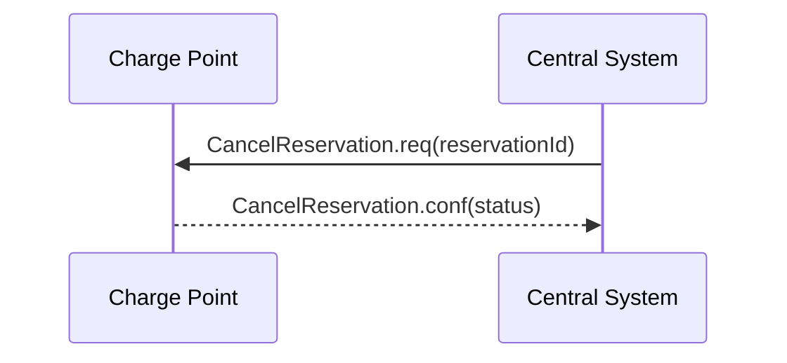

*Figure 22. Sequence Diagram: Cancel Reservation*

To cancel a reservation the Central System SHALL send an CancelReservation.req PDU to the Charge Point.

If the Charge Point has a reservation matching the reservationId in the request PDU, it SHALL return status ‘Accepted’. Otherwise it SHALL return ‘Rejected’.

## 5.2. Change Availability

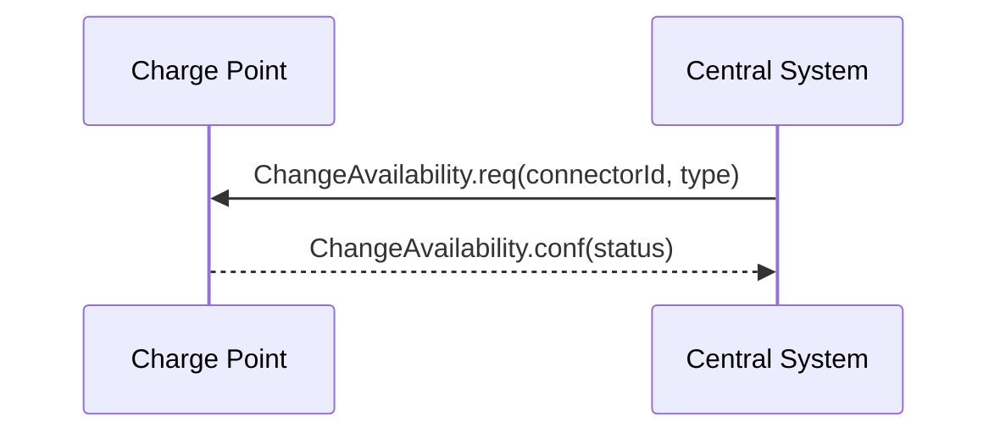

*Figure 23. Sequence Diagram: Change Availability*

Central System can request a Charge Point to change its availability. A Charge Point is considered available (“operative”) when it is charging or ready for charging. A Charge Point is considered unavailable when it does not allow any charging. The Central System SHALL send a ChangeAvailability.req PDU for requesting a Charge Point to change its availability. The Central System can change the availability to available or unavailable.

Upon receipt of a ChangeAvailability.req PDU, the Charge Point SHALL respond with a ChangeAvailability.conf PDU. The response PDU SHALL indicate whether the Charge Point is able to change to the requested availability or not. When a transaction is in progress Charge Point SHALL respond with availability status 'Scheduled' to indicate that it is scheduled to occur after the transaction has finished.

In the event that Central System requests Charge Point to change to a status it is already in, Charge Point SHALL respond with availability status ‘Accepted’.

When an availability change requested with a ChangeAvailability.req PDU has happened, the Charge Point SHALL inform Central System of its new availability status with a StatusNotification.req as described there.

> In the case the ChangeAvailability.req contains ConnectorId = 0, the status change applies to the Charge Point and all Connectors.

> Persistent states: for example: Connector set to Unavailable shall persist a reboot.

## 5.3. Change Configuration

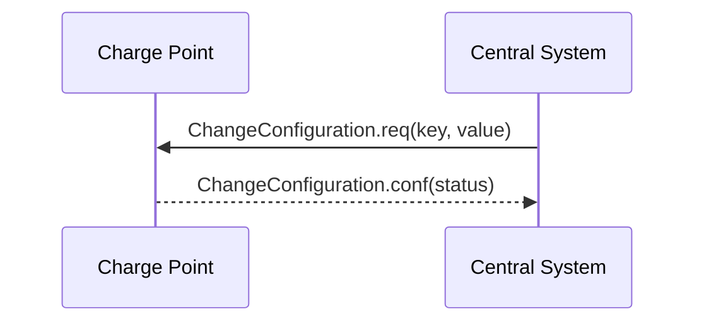

*Figure 24. Sequence Diagram: Change Configuration*

Central System can request a Charge Point to change configuration parameters. To achieve this, Central System SHALL send a ChangeConfiguration.req. This request contains a key-value pair, where "key" is the name of the configuration setting to change and "value" contains the new setting for the configuration setting.

Upon receipt of a ChangeConfiguration.req Charge Point SHALL reply with a ChangeConfiguration.conf indicating whether it was able to apply the change to its configuration. Content of "key" and "value" is not prescribed. The Charge Point SHALL set the status field in the ChangeConfiguration.conf according to the following rules:

- If the change was applied successfully, and the change if effective immediately, the Charge Point SHALL respond with a status 'Accepted'.
- If the change was applied successfully, but a reboot is needed to make it effective, the Charge Point SHALL respond with status 'RebootRequired'.
- If "key" does not correspond to a configuration setting supported by Charge Point, it SHALL respond with a status 'NotSupported'.
- If the Charge Point did not set the configuration, and none of the previous statuses applies, the Charge Point SHALL respond with status 'Rejected'.

> Examples of Change Configuration requests to which a Charge Point responds with a ChangeConfiguration.conf with a status of 'Rejected' are requests with out-of-range values and requests with values that do not conform to an expected format.

If a key value is defined as a CSL, it MAY be accompanied with a [KeyName]MaxLength key, indicating the max length of the CSL in items. If this key is not set, a safe value of 1 (one) item SHOULD be assumed.

## 5.4. Clear Cache

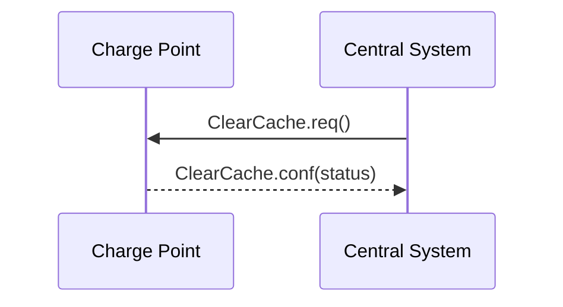

*Figure 25. Sequence Diagram: Clear Cache*

Central System can request a Charge Point to clear its Authorization Cache. The Central System SHALL send a ClearCache.req PDU for clearing the Charge Point’s Authorization Cache.

Upon receipt of a ClearCache.req PDU, the Charge Point SHALL respond with a ClearCache.conf PDU. The response PDU SHALL indicate whether the Charge Point was able to clear its Authorization Cache.

## 5.5. Clear Charging Profile

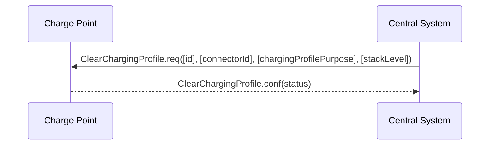

*Figure 26. Sequence Diagram: Clear Charging Profile*

If the Central System wishes to clear some or all of the charging profiles that were previously sent the Charge Point, it SHALL use the ClearChargingProfile.req PDU.

The Charge Point SHALL respond with a ClearChargingProfile.conf PDU specifying whether it was able to process the request.

## 5.6. Data Transfer

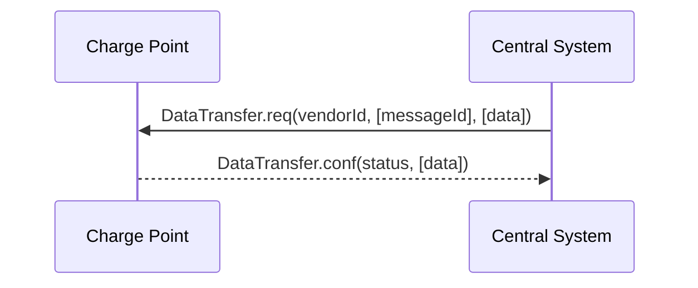

*Figure 27. Sequence Diagram: Data Transfer*

If the Central System needs to send information to a Charge Point for a function not supported by OCPP, it SHALL use the DataTransfer.req PDU.

Behaviour of this operation is identical to the Data Transfer operation initiated by the Charge Point. See [[04-Operations-Initiated-by-Charge-Point#4.3. Data Transfer|Data Transfer]] for details.

## 5.7. Get Composite Schedule

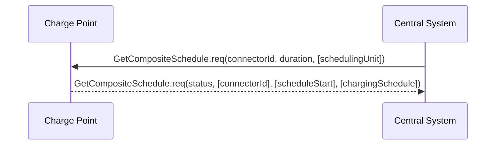

*Figure 28. Sequence Diagram: Get Composite Schedule*

The Central System MAY request the Charge Point to report the Composite Charging Schedule by sending a GetCompositeSchedule.req PDU. The reported schedule, in the GetCompositeSchedule.conf PDU, is the result of the calculation of all active schedules and possible local limits present in the Charge Point. Local Limits might be taken into account.

Upon receipt of a GetCompositeSchedule.req, the Charge Point SHALL calculate the Composite Charging Schedule intervals, from the moment the request PDU is received: Time X, up to X + Duration, and send them in the GetCompositeSchedule.conf PDU to the Central System.

If the ConnectorId in the request is set to '0', the Charge Point SHALL report the total expected power or current the Charge Point expects to consume from the grid during the requested time period.

> Please note that the charging schedule sent by the charge point is only indicative for that point in time. this schedule might change over time due to external causes (for instance, local balancing based on grid connection capacity is active and one Connector becomes available).

If the Charge Point is not able to report the requested schedule, for instance if the connectorId is unknown, it SHALL respond with a status Rejected.

## 5.8. Get Configuration

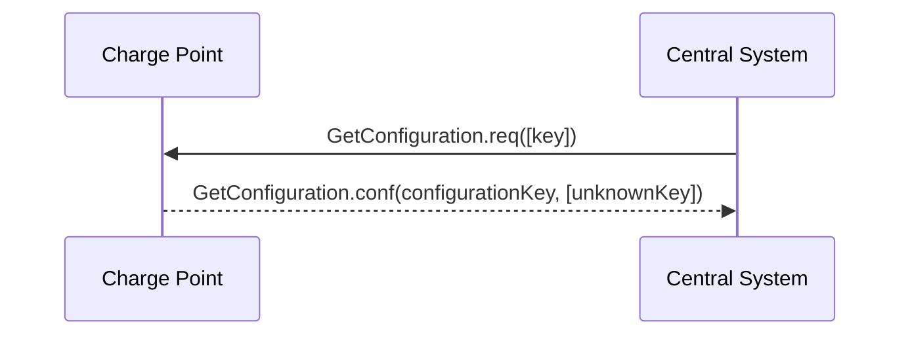

*Figure 29. Sequence Diagram: Get Configuration*

To retrieve the value of configuration settings, the Central System SHALL send a GetConfiguration.req PDU to the Charge Point.

If the list of keys in the request PDU is empty or missing (it is optional), the Charge Point SHALL return a list of all configuration settings in GetConfiguration.conf. Otherwise Charge Point SHALL return a list of recognized keys and their corresponding values and read-only state. Unrecognized keys SHALL be placed in the response PDU as part of the optional unknown key list element of GetConfiguration.conf.

The number of configuration keys requested in a single PDU MAY be limited by the Charge Point. This maximum can be retrieved by reading the configuration key GetConfigurationMaxKeys.

## 5.9. Get Diagnostics

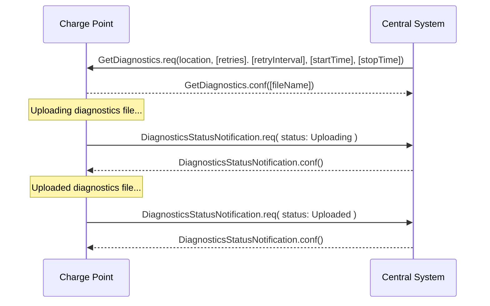

*Figure 30. Sequence Diagram: Get Diagnostics*

Central System can request a Charge Point for diagnostic information. The Central System SHALL send a GetDiagnostics.req PDU for getting diagnostic information of a Charge Point with a location where the Charge Point MUST upload its diagnostic data to and optionally a begin and end time for the requested diagnostic information.

Upon receipt of a GetDiagnostics.req PDU, and if diagnostics information is available then Charge Point SHALL respond with a GetDiagnostics.conf PDU stating the name of the file containing the diagnostic information that will be uploaded. Charge Point SHALL upload a single file. Format of the diagnostics file is not prescribed. If no diagnostics file is available, then GetDiagnostics.conf SHALL NOT contain a file name.

During uploading of a diagnostics file, the Charge Point MUST send DiagnosticsStatusNotification.req PDUs to keep the Central System updated with the status of the upload process.

## 5.10. Get Local List Version

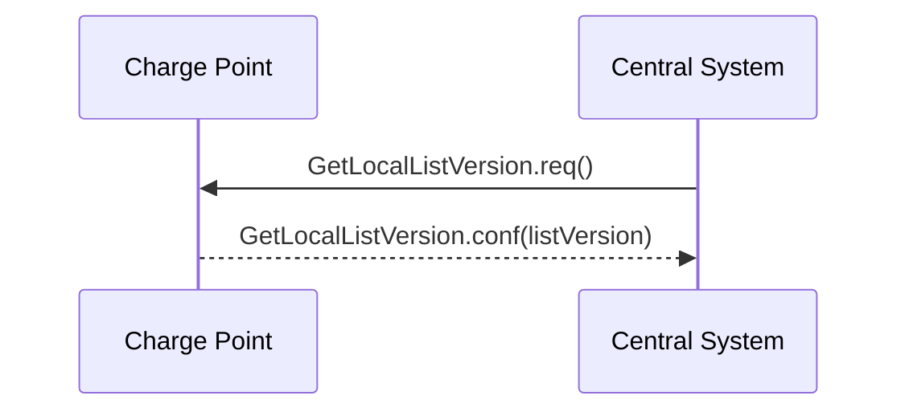

*Figure 31. Sequence Diagram: Get Local List Version*

In order to support synchronisation of the Local Authorization List, Central System can request a Charge Point for the version number of the Local Authorization List. The Central System SHALL send a GetLocalListVersion.req PDU to request this value.

Upon receipt of a GetLocalListVersion.req PDU Charge Point SHALL respond with a GetLocalListVersion.conf PDU containing the version number of its Local Authorization List. A version number of 0 (zero) SHALL be used to indicate that the local authorization list is empty, and a version number of -1 SHALL be used to indicate that the Charge Point does not support Local Authorization Lists.

## 5.11. Remote Start Transaction

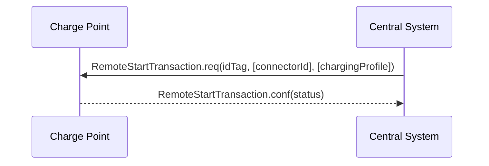

*Figure 32. Sequence Diagram: Remote Start Transaction*

Central System can request a Charge Point to start a transaction by sending a RemoteStartTransaction.req. Upon receipt, the Charge Point SHALL reply with RemoteStartTransaction.conf and a status indicating whether it has accepted the request and will attempt to start a transaction.

The effect of the RemoteStartTransaction.req message depends on the value of the AuthorizeRemoteTxRequests configuration key in the Charge Point.

- If the value of AuthorizeRemoteTxRequests is true, the Charge Point SHALL behave as if in response to a local action at the Charge Point to start a transaction with the idTag given in the RemoteStartTransaction.req message. This means that the Charge Point will first try to authorize the idTag, using the Local Authorization List, Authorization Cache and/or an Authorize.req request. A transaction will only be started after authorization was obtained.
- If the value of AuthorizeRemoteTxRequests is false, the Charge Point SHALL immediately try to start a transaction for the idTag given in the RemoteStartTransaction.req message. Note that after the transaction has been started, the Charge Point will send a StartTransaction request to the Central System, and the Central System will check the authorization status of the idTag when processing this StartTransaction request.

The following typical use cases are the reason for Remote Start Transaction:

- Enable a CPO operator to help an EV driver that has problems starting a transaction.
- Enable mobile apps to control charging transactions via the Central System.
- Enable the use of SMS to control charging transactions via the Central System.

The RemoteStartTransaction.req SHALL contain an identifier (idTag), which Charge Point SHALL use, if it is able to start a transaction, to send a StartTransaction.req to Central System. The transaction is started in the same way as described in [[04-Operations-Initiated-by-Charge-Point#4.8. Start Transaction|StartTransaction]]. The RemoteStartTransaction.req MAY contain a connector id if the transaction is to be started on a specific connector. When no connector id is provided, the Charge Point is in control of the connector selection. A Charge Point MAY reject a RemoteStartTransaction.req without a connector id.

The Central System MAY include a ChargingProfile in the RemoteStartTransaction request. The purpose of this ChargingProfile SHALL be set to TxProfile. If accepted, the Charge Point SHALL use this ChargingProfile for the transaction.

> If a Charge Point without support for Smart Charging receives a RemoteStartTransaction.req with a Charging Profile, this parameter SHOULD be ignored.

## 5.12. Remote Stop Transaction

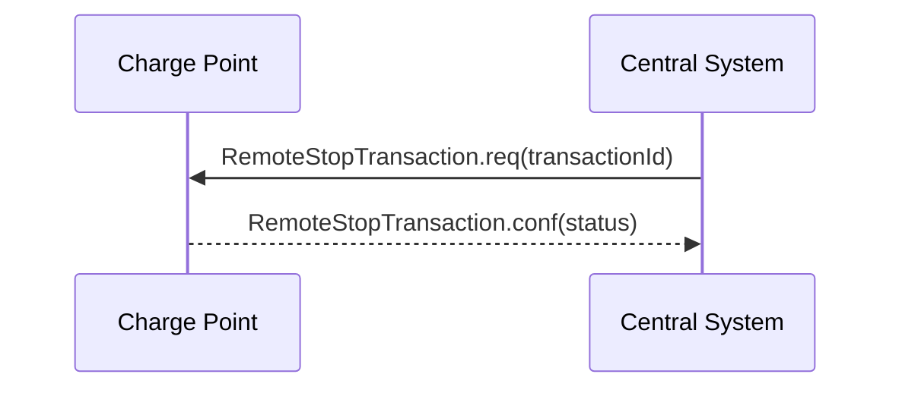

*Figure 33. Sequence Diagram: Remote Stop Transaction*

Central System can request a Charge Point to stop a transaction by sending a RemoteStopTransaction.req to Charge Point with the identifier of the transaction. Charge Point SHALL reply with RemoteStopTransaction.conf and a status indicating whether it has accepted the request and a transaction with the given transactionId is ongoing and will be stopped.

This remote request to stop a transaction is equal to a local action to stop a transaction. Therefore, the transaction SHALL be stopped, The Charge Point SHALL send a StopTransaction.req and, if applicable, unlock the connector.

The following two main use cases are the reason for Remote Stop Transaction:

- Enable a CPO operator to help an EV driver that has problems stopping a transaction.
- Enable mobile apps to control charging transactions via the Central System.

## 5.13. Reserve Now

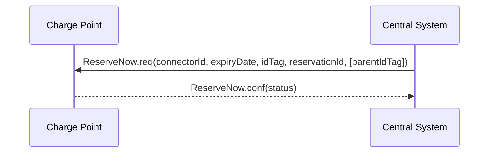

*Figure 34. Sequence Diagram: Reserve Now*

A Central System can issue a ReserveNow.req to a Charge Point to reserve a connector for use by a specific idTag.

To request a reservation the Central System SHALL send a ReserveNow.req PDU to a Charge Point. The Central System MAY specify a connector to be reserved. Upon receipt of a ReserveNow.req PDU, the Charge Point SHALL respond with a ReserveNow.conf PDU.

If the reservationId in the request matches a reservation in the Charge Point, then the Charge Point SHALL replace that reservation with the new reservation in the request.

If the reservationId does not match any reservation in the Charge Point, then the Charge Point SHALL return the status value ‘Accepted’ if it succeeds in reserving a connector. The Charge Point SHALL return ‘Occupied’ if the Charge Point or the specified connector are occupied. The Charge Point SHALL also return ‘Occupied’ when the Charge Point or connector has been reserved for the same or another idTag. The Charge Point SHALL return ‘Faulted’ if the Charge Point or the connector are in the Faulted state. The Charge Point SHALL return ‘Unavailable’ if the Charge Point or connector are in the Unavailable state. The Charge Point SHALL return ‘Rejected’ if it is configured not to accept reservations.

If the Charge Point accepts the reservation request, then it SHALL refuse charging for all incoming idTags on the reserved connector, except when the incoming idTag or the parent idTag match the idTag or parent idTag of the reservation.

When the configuration key: ReserveConnectorZeroSupported is set to true the Charge Point supports reservations on connector 0. If the connectorId in the reservation request is 0, then the Charge Point SHALL NOT reserve a specific connector, but SHALL make sure that at any time during the validity of the reservation, one connector remains available for the reserved idTag. If the configuration key: ReserveConnectorZeroSupported is not set or set to false, the Charge Point SHALL return ‘Rejected’

If the parent idTag in the reservation has a value (it is optional), then in order to determine the parent idTag that is associated with an incoming idTag, the Charge Point MAY look it up in its Local Authorization List or Authorization Cache. If it is not found in the Local Authorization List or Authorization Cache, then the Charge Point SHALL send an Authorize.req for the incoming idTag to the Central System. The Authorize.conf response MAY contain the parent-id.

A reservation SHALL be terminated on the Charge Point when either (1) a transaction is started for the reserved idTag or parent idTag and on the reserved connector or any connector when the reserved connectorId is 0, or (2) when the time specified in expiryDate is reached, or (3) when the Charge Point or connector are set to Faulted or Unavailable.

If a transaction for the reserved idTag is started, then Charge Point SHALL send the reservationId in the StartTransaction.req PDU (see [[04-Operations-Initiated-by-Charge-Point#4.8. Start Transaction|Start Transaction]]) to notify the Central System that the reservation is terminated.

When a reservation expires, the Charge Point SHALL terminate the reservation and make the connector available. The Charge Point SHALL send a status notification to notify the Central System that the reserved connector is now available.

If Charge Point has implemented an Authorization Cache, then upon receipt of a ReserveNow.conf PDU the Charge Point SHALL update the cache entry, if the idTag is not in the Local Authorization List, with the IdTagInfo value from the response as described under [[03-Introduction#3.5.1. Authorization Cache|Authorization Cache]].

> It is RECOMMENDED to validate the Identifier with an authorize.req after reception of a ReserveNow.req and before the start of the transaction.

## 5.14. Reset

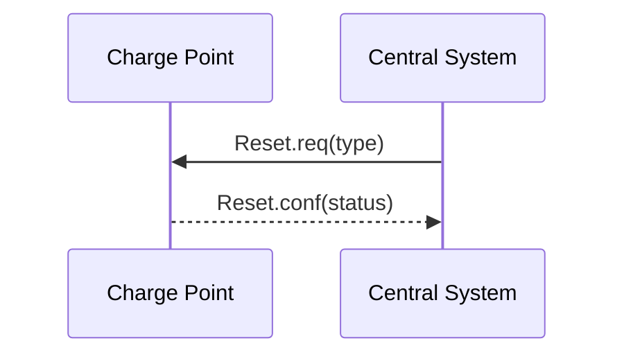

*Figure 35. Sequence Diagram: Reset*

The Central System SHALL send a Reset.req PDU for requesting a Charge Point to reset itself. The Central System can request a hard or a soft reset. Upon receipt of a Reset.req PDU, the Charge Point SHALL respond with a Reset.conf PDU. The response PDU SHALL include whether the Charge Point will attempt to reset itself.

After receipt of a Reset.req, The Charge Point SHALL send a StopTransaction.req for any ongoing transaction before performing the reset. If the Charge Point fails to receive a StopTransaction.conf form the Central System, it shall queue the StopTransaction.req.

At receipt of a soft reset, the Charge Point SHALL stop ongoing transactions gracefully and send StopTransaction.req for every ongoing transaction. It should then restart the application software (if possible, otherwise restart the processor/controller).

At receipt of a hard reset the Charge Point SHALL restart (all) the hardware, it is not required to gracefully stop ongoing transaction. If possible the Charge Point sends a StopTransaction.req for previously ongoing transactions after having restarted and having been accepted by the Central System via a BootNotification.conf. This is a last resort solution for a not correctly functioning Charge Points, by sending a "hard" reset, (queued) information might get lost.

> Persistent states: for example: Connector set to Unavailable shall persist.

## 5.15. Send Local List

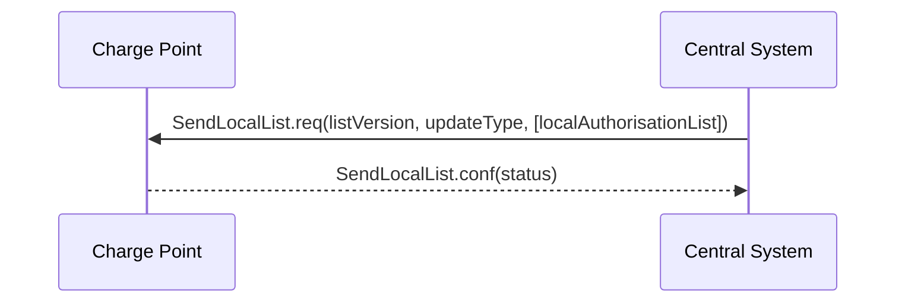

*Figure 36. Sequence Diagram: Send Local List*

Central System can send a Local Authorization List that a Charge Point can use for authorization of idTags. The list MAY be either a full list to replace the current list in the Charge Point or it MAY be a differential list with updates to be applied to the current list in the Charge Point.

The Central System SHALL send a SendLocalList.req PDU to send the list to a Charge Point. The SendLocalList.req PDU SHALL contain the type of update (full or differential) and the version number that the Charge Point MUST associate with the local authorization list after it has been updated.

Upon receipt of a SendLocalList.req PDU, the Charge Point SHALL respond with a SendLocalList.conf PDU. The response PDU SHALL indicate whether the Charge Point has accepted the update of the local authorization list. If the status is Failed or VersionMismatch and the updateType was Differential, then Central System SHOULD retry sending the full local authorization list with updateType Full.

## 5.16. Set Charging Profile

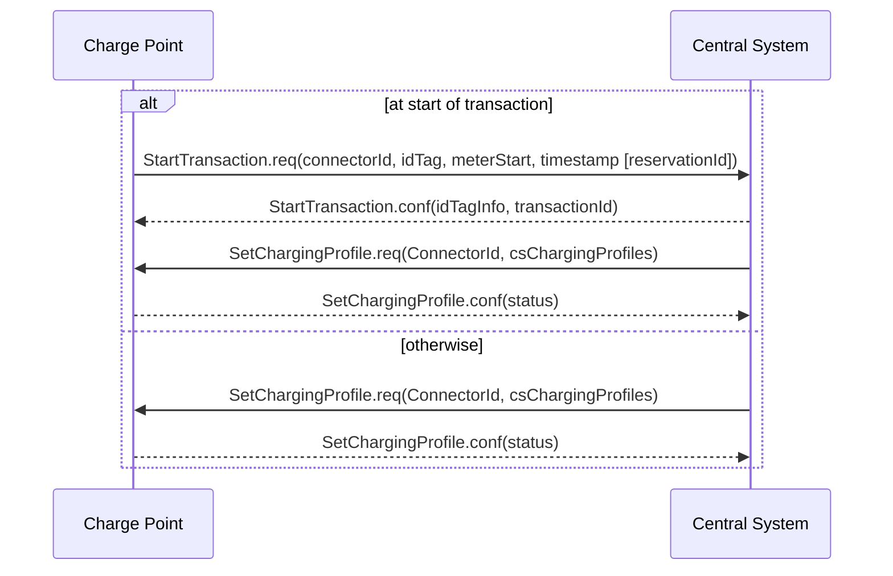

*Figure 37. Sequence Diagram: Set Charging Profile*

A Central System can send a SetChargingProfile.req to a Charge Point, to set a charging profile, in the following situations:

- At the start of a transaction to set the charging profile for the transaction;
- In a RemoteStartTransaction.req sent to a Charge Point
- During a transaction to change the active profile for the transaction;
- Outside the context of a transaction as a separate message to set a charging profile to a local controller, Charge Point, or a default charging profile to a connector.

> To prevent mismatch between transactions and a TxProfile, The Central System SHALL include the transactionId in a SetChargingProfile.req if the profile applies to a specific transaction.

These situations are described below.

### 5.16.1. Setting a charging profile at start of transaction

If the Central System receives a StartTransaction.req the Central System SHALL respond with a StartTransaction.conf. If there is a need for a charging profile, The Central System MAY choose to send a SetChargingProfile.req to the Charge Point.

It is RECOMMENDED to check the timestamp in the StartTransaction.req PDU prior to sending a charging profile to check if the transaction is likely to be still ongoing. The StartTransaction.req might have been cached during an offline period.

### 5.16.2. Setting a charge profile in a RemoteStartTransaction request

The Central System MAY include a charging profile in a RemoteStartTransaction request.

If the Central System includes a ChargingProfile, the ChargingProfilePurpose MUST be set to TxProfile and the transactionId SHALL NOT be set.

> The Charge Point SHALL apply the given profile to the newly started transaction. This transaction will get a transactionId assigned by Central System via a StartTransaction.conf. When the Charge Point receives a SetChargingProfile.req, with the transactionId for this transaction, with the same StackLevel as the profile given in the RemoteStartTransaction.req, the Charge Point SHALL replace the existing charging profile, otherwise it SHALL install/stack the profile next to the already existing profile(s).

### 5.16.3. Setting a charging profile during a transaction.

The Central System MAY send a charging profile to a Charge Point to update the charging profile for that transaction. The Central System SHALL use the SetChargingProfile.req PDU for that purpose. If a charging profile with the same chargingProfileId, or the same combination of stackLevel / ChargingProfilePurpose, exists on the Charge Point, the new charging profile SHALL replace the existing charging profile, otherwise it SHALL be added. The Charge Point SHALL then re-evaluate its collection of charge profiles to determine which charging profile will become active. In order to ensure that the updated charging profile applies only to the current transaction, the chargingProfilePurpose of the ChargingProfile MUST be set to TxProfile. (See section: [[03-Introduction#3.13.1. Charging profile purposes|Charging Profile Purposes]])

### 5.16.4. Setting a charging profile outside of a transaction

The Central System MAY send charging profiles to a Charge Point that are to be used as default charging profiles. The Central System SHALL use the SetChargingProfile.req PDU for that purpose. Such charging profiles MAY be sent at any time. If a charging profile with the same chargingProfileId, or the same combination of stackLevel / ChargingProfilePurpose, exists on the Charge Point, the new charging profile SHALL replace the existing charging profile, otherwise it SHALL be added. The Charge Point SHALL then re-evaluate its collection of charge profiles to determine which charging profile will become active.

> It is not possible to set a ChargingProfile with purpose set to TxProfile without presence of an active transaction, or in advance of a transaction.

> When a ChargingProfile is refreshed during execution, it is advised to put the startSchedule of the new ChargingProfile in the past, so there is no period of default charging behaviour inbetween the ChargingProfiles. The Charge Point SHALL continue to execute the existing ChargingProfile until the new ChargingProfile is installed.

> If the chargingSchedulePeriod is longer than duration, the remainder periods SHALL not be executed. If duration is longer than the chargingSchedulePeriod, the Charge Point SHALL keep the value of the last chargingSchedulePeriod until duration has ended.

> When recurrencyKind is used in combination with a chargingSchedulePeriod and/or duration that is longer then the recurrence period duration, the remainder periods SHALL not be executed.

> The StartSchedule of the first chargingSchedulePeriod in a chargingSchedule SHALL always be 0.

> When recurrencyKind is used in combination with a chargingSchedule duration shorter than the recurrencyKind period, the Charge Point SHALL fall back to default behaviour after the chargingSchedule duration ends. This fall back means that the Charge Point SHALL use a ChargingProfile with a lower stackLevel if available. If no other ChargingProfile is available, the Charge Point SHALL allow charging as if no ChargingProfile is installed. If the chargingSchedulePeriod and/or duration is longer then the recurrence period duration, the remainder periods SHALL not be executed.

## 5.17. Trigger Message

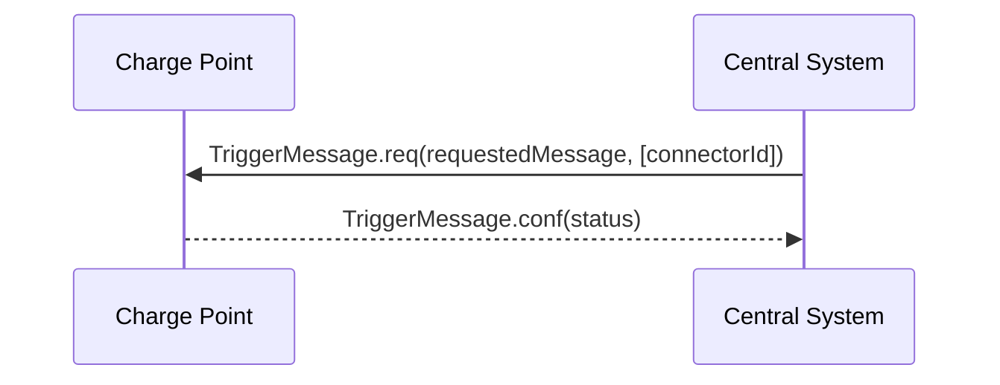

*Figure 38. Sequence Diagram: Trigger Message*

During normal operation, the Charge Point informs the Central System of its state and any relevant occurrences. If there is nothing to report the Charge Point will send at least a heartBeat at a predefined interval. Under normal circumstances this is just fine, but what if the Central System has (whatever) reason to doubt the last known state? What can a Central System do if a firmware update is in progress and the last status notification it received about it was much longer ago than could reasonably be expected? The same can be asked for the progress of a diagnostics request. The problem in these situations is not that the information needed isn’t covered by existing messages, the problem is strictly a timing issue. The Charge Point has the information, but has no way of knowing that the Central System would like an update.

The TriggerMessage.req makes it possible for the Central System, to request the Charge Point, to send Charge Point-initiated messages. In the request the Central System indicates which message it wishes to receive. For every such requested message the Central System MAY optionally indicate to which connector this request applies. The requested message is leading: if the specified connectorId is not relevant to the message, it should be ignored. In such cases the requested message should still be sent.

Inversely, if the connectorId is relevant but absent, this should be interpreted as “for all allowed connectorId values”. For example, a request for a statusNotification for connectorId 0 is a request for the status of the Charge Point. A request for a statusNotification without connectorId is a request for multiple statusNotifications: the notification for the Charge Point itself and a notification for each of its connectors.

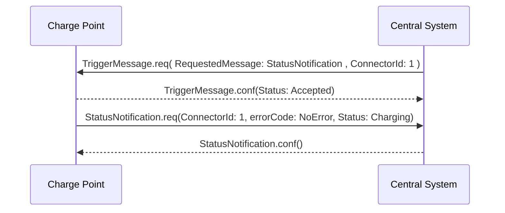

*Figure 39. Sequence Diagram: Trigger Message StatusNotification Example*

The Charge Point SHALL first send the TriggerMessage response, before sending the requested message. In the TriggerMessage.conf the Charge Point SHALL indicate whether it will send it or not, by returning ACCEPTED or REJECTED. It is up to the Charge Point if it accepts or rejects the request to send. If the requested message is unknown or not implemented the Charge Point SHALL return NOT_IMPLEMENTED.

Messages that the Charge Point marks as accepted SHOULD be sent. The situation could occur that, between accepting the request and actually sending the requested message, that same message gets sent because of normal operations. In such cases the message just sent MAY be considered as complying with the request.

The TriggerMessage mechanism is not intended to retrieve historic data. The messages it triggers should only give current information. A MeterValues.req message triggered in this way for instance SHALL return the most recent measurements for all measurands configured in configuration key MeterValuesSampledData. StartTransaction and StopTransaction have been left out of this mechanism because they are not state related, but by their nature describe a transition.

## 5.18. Unlock Connector

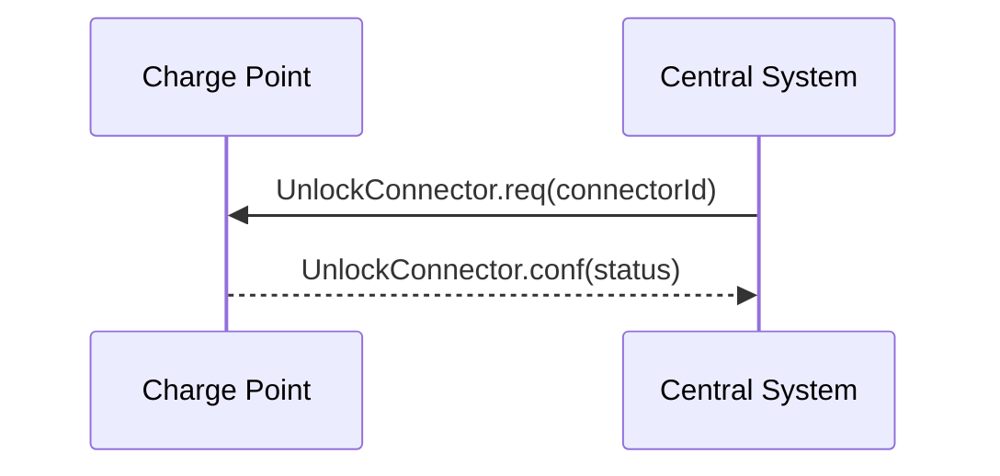

*Figure 40. Sequence Diagram: Unlock Connector*

Central System can request a Charge Point to unlock a connector. To do so, the Central System SHALL send an UnlockConnector.req PDU.

The purpose of this message: Help EV drivers that have problems unplugging their cable from the Charge Point in case of malfunction of the Connector cable retention. When a EV driver calls the CPO help-desk, an operator could manually trigger the sending of an UnlockConnector.req to the Charge Point, forcing a new attempt to unlock the connector. Hopefully this time the connector unlocks and the EV driver can unplug the cable and drive away.

The UnlockConnector.req SHOULD NOT be used to remotely stop a running transaction, use the Remote Stop Transaction instead.

Upon receipt of an UnlockConnector.req PDU, the Charge Point SHALL respond with a UnlockConnector.conf PDU. The response PDU SHALL indicate whether the Charge Point was able to unlock its connector.

If there was a transaction in progress on the specific connector, then Charge Point SHALL finish the transaction first as described in [[04-Operations-Initiated-by-Charge-Point#4.10. Stop Transaction|Stop Transaction]].

> UnlockConnector.req is intented only for unlocking the cable retention lock on the Connector, not for unlocking a connector access door.

## 5.19. Update Firmware

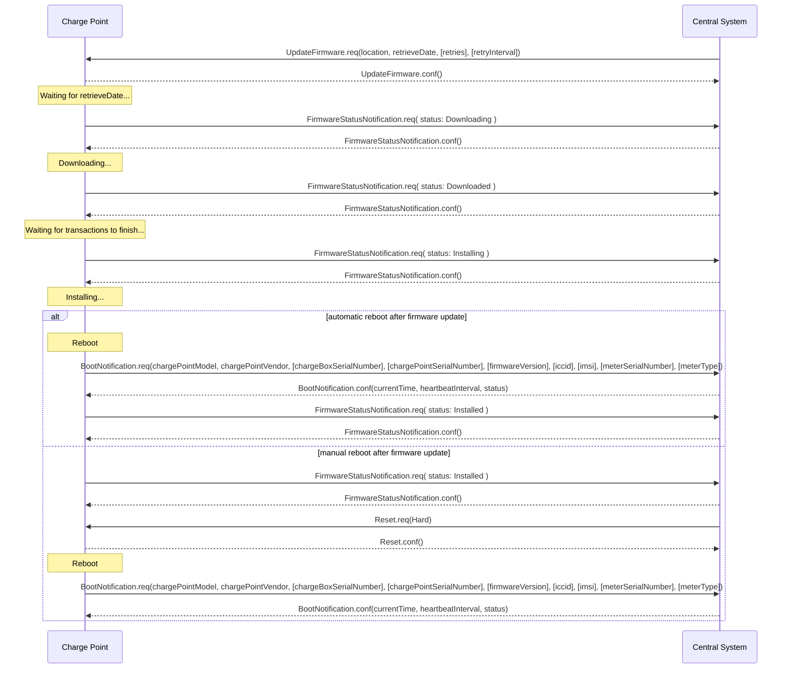

*Figure 41. Sequence Diagram: Update Firmware*

Central System can notify a Charge Point that it needs to update its firmware. The Central System SHALL send an UpdateFirmware.req PDU to instruct the Charge Point to install new firmware. The PDU SHALL contain a date and time after which the Charge Point is allowed to retrieve the new firmware and the location from which the firmware can be downloaded.

Upon receipt of an UpdateFirmware.req PDU, the Charge Point SHALL respond with a UpdateFirmware.conf PDU. The Charge Point SHOULD start retrieving the firmware as soon as possible after retrieve-date.

During downloading and installation of the firmware, the Charge Point MUST send FirmwareStatusNotification.req PDUs to keep the Central System updated with the status of the update process.

The Charge Point SHALL, if the new firmware image is "valid", install the new firmware as soon as it is able to.

If it is not possible to continue charging during installation of firmware, it is RECOMMENDED to wait until Charging Session has ended (Charge Point idle) before commencing installation. It is RECOMMENDED to set connectors that are not in use to UNAVAILABLE while the Charge Point waits for the Session to end.

> The sequence diagram above is an example. It is good practice to first reboot the Charge Point to check the new firmware is booting and able to connect to the Central System, before sending the status: Installed. This is not a requirement.
